# Chapter1 OpenWrt虚拟机的搭建

## 实验目的

- 熟悉基于 OpenWrt 的无线接入点（AP）配置
- 为第二章、第三章和第四章实验准备好「无线软 AP」环境

## 实验环境

- 宿主机Windows10

- VirtualBox 6.1.10 已安装Extension Pack

- Openwrt 19.07.5

  

## 实验要求

1. 对照 [第一章 实验](https://c4pr1c3.github.io/cuc-mis/chap0x01/exp.html) `无线路由器/无线接入点（AP）配置` 列的功能清单，找到在 OpenWrt 中的配置界面并截图证明；

   - 重置和恢复AP到出厂默认设置状态√

   - 设置AP的管理员用户名和密码 √ 

   - 设置SSID广播和非广播模式 √
   - 配置不同的加密方式 √
   - 设置AP管理密码 √
   - 配置无线路由器使用自定义的DNS解析服务器 √
   - 配置DHCP和禁用DHCP √
   - 开启路由器/AP的日志记录功能（对指定事件记录）√
   - 配置AP隔离(WLAN划分)功能 √
   - 设置MAC地址过滤规则（ACL地址过滤器）√
   - 查看WPS功能的支持情况 √
   - 查看AP/无线路由器支持哪些工作模式 √

2. 记录环境搭建步骤；

3. 如果 USB 无线网卡能在 `OpenWrt` 中正常工作，则截图证明；


## 记录环境搭建步骤/出现的问题：按操作的时间顺序

1. 去OpenWrt官网下载了openwrt-19.07.7-x86-64-combined-squashfs.img的压缩包，并解压缩

   

2. 首先将VirtualBox的安装路径加入到宿主机的环境变量中，不然VBoxManage命令会找不到 - 将.img镜像转换成.vdi虚拟介质`VBoxManage convertfromraw --format VDI openwrt-19.07.7-x86-64-combined-squashfs.img openwrt-x86-64-combined-squashfs.vdi` 出现报错 ` VBoxManage: error: Cannot create the disk image “openwrt-x86-64-combined-squashfs.vdi”: VERR_VD_INVALID_SIZE` 通过搜索参照[这个](https://openwrt.org/zh/docs/guide-user/virtualization/virtualbox-vm)得知要用`dd if=lede-x86-64-combined-squashfs.img of=lede.img bs=128000 conv=sync`重新整合镜像，Win10宿主机系统直接执行没有`dd`这个命令，于是通过psftp将img镜像传到一个kali虚拟机上执行整合镜像命令，得到openwrt-dd.img，传回Win10宿主机，再次执行转换`VBoxManage convertfromraw --format VDI openwrt-dd.img openwrt-x86-64-combined-squashfs.vdi`成功

   

3. 新建虚拟机 - 选择「类型」 Linux / 「版本」Linux 2.6 / 3.x / 4.x (64-bit)，内存设为256MB - 使用已有的虚拟硬盘文件 - 「注册」新虚拟硬盘文件选择刚才转换生成的 openwrt-x86-64-combined-squashfs.vdi文件 - 设置网络，将第一块网卡设置为Host-Only网络，选择界面名称时确认主机网络管理中配置符合要求 如图 - 第二块网卡设置为网络地址转换NAT

   

   

4. 开机 - 滚动条不再滚动进入终端控制台 看见OpenWrt欢迎图形 - `ip a`查看网络配置 `vi /etc/config/network`更改网络配置，将ip地址更改使得宿主机可以连接OpenWrt，参照[this](https://openwrt.org/zh-cn/doc/uci/network)`/etc/init.d/network reload`重启网络

   ```txt
   config interface 'lan'
       option type 'bridge'
       option ifname 'eth0'
       option proto 'static'
       option ipaddr '192.168.56.113' 
       option netmask '255.255.255.0'
       option ip6assign '60'
   ```

   

5. `ping baidu.com`查看互联网连通性，报错`ping baidu.com: bad address`，参照[this](https://openwrt.org/zh-cn/doc/uci/network)再次更改网络配置如下，连通性终于正常

   ```txt
   # 两个网卡都变成自动分配IP地址，
   config interface 'example0'
           option proto 'dhcp'
           option ifname 'eth0'
   
   config interface 'example1'
           option proto 'dhcp'
           option ifname 'eth1'
   ```

   

6. PuTTY SSH连接，方便管理 - 执行`opkg update` 部分报错下载失败，类似

   ```txt
   Collected Errors:
    * opkg_download: Failed to download http://download.openwrt.org/releases/19.07.7/packages/x86_64/luci/Packages.sig, wget return 4.
    * opkg_download: Check your network settings and connectivity.
   ```

   最后报错的总结中可能出现出现多个下载失败错误，可能是由于网络不稳定，多执行几次`opkg update`直到不出现错误为止

   

7. 系统本身已安装好luci - 宿主机浏览器输入IP 192.168.56.113 登陆Web管理页面，如图 

   

   

   

8. 为了开启AP功能，执行`opkg find usbutils`能找到usbutil package，如图

   

   `opkg install usbutils`安装无线网卡管理包，出现报错`verify_pkg_installable: Only have 117kb available on filesystem/overlay, pkg usbutils needs 241` 如图

   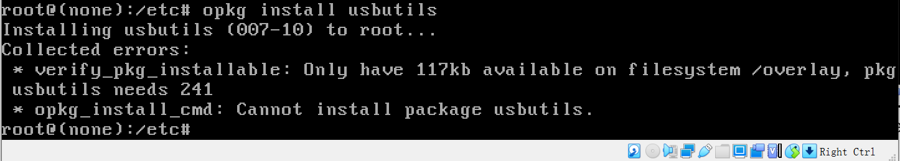

   `df -h`看了 filesystem /overlay剩余空间小 但是有其它文件夹剩余空间大 如图

   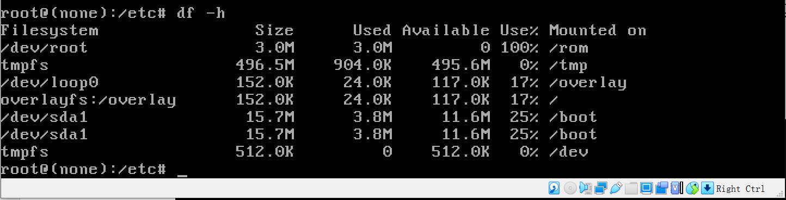

   试图在/etc/opkg.conf中将安装目录改成其他文件 都提示opkg.conf no space left on device 只能q!退出。查看了opkg.conf的权限，root可以读写，试图修改权限也显示`no space left on device`。试图挪走/overlay里的文件 还是原来剩余的空间不变。这些均为无效尝试，经同学指点决定下载openwrt-19.07.7-x86-64-combined-squashfs.img按照老师提供的[脚本](https://github.com/c4pr1c3/cuc-mis-ppt/blob/master/exp/chap0x01/setup-vm.sh)重装系统

   

9. 读懂了脚本，根据实际情况对脚本的参数进行了修改，git bash 运行脚本下载解压缩镜像成功，但是resize磁盘大小的时候报错，如图。

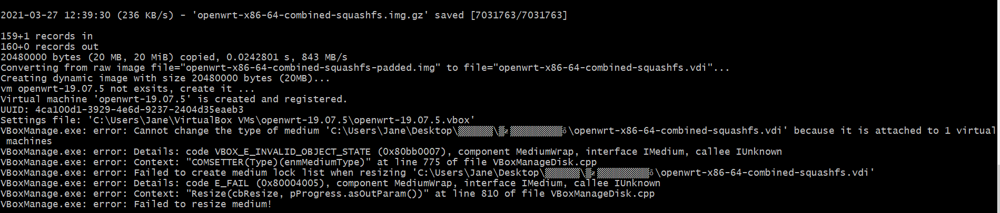


10. 手动执行转换和resize磁盘大小命令，如图，成功

    

    

11. 得到有10G磁盘容量的openwrt.vdi，新建虚拟机 - 选择「类型」 Linux / 「版本」Linux 2.6 / 3.x / 4.x (64-bit)，内存设为256MB - 使用已有的虚拟硬盘文件 - 「注册」新虚拟硬盘文件选择刚才转换生成的 openwrt.vdi文件 - 设置网络，将第一块网卡设置为Host-Only网络，选择界面名称时确认主机网络管理中配置符合要求 - 第二块网卡设置为网络地址转换NAT

    

12. 开启虚拟机 - `vi /etc/config/network`网络配置如下，`ping baidu.com`测试互联网连通性正常

    ```txt
    config interface 'loopback'
            option ifname 'lo'
            option proto 'static'
            option ipaddr '127.0.0.1'
            option netmask '255.0.0.0'
    
    config globals 'globals'
            option ula_prefix 'fd61:9ede:1812::/48'
    
    config interface 'lan'
            option type 'bridge'
            option ifname 'eth0'
            option proto 'static'
            option ipaddr '192.168.56.113'
            option netmask '255.255.255.0'
            option ip6assign '60'
    
    config interface 'wan'
            option ifname 'eth1'
            option proto 'dhcp'
    
    config interface 'wan6'
            option ifname 'eth1'
            option proto 'dhcpv6'
    ```

    

13. 安装查看USB信息的包和无线网卡的驱动。首先将虚拟机USB设置成3.0（必须关机设置），插入无线网卡，然后加载无线网卡到虚拟机，如图；安装所有过程如下：

    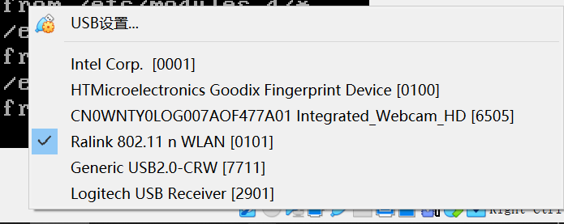

    ```txt
    root@OpenWrt:~# opkg install usbutils
    Installing usbutils (007-10) to root...
    Downloading http://downloads.openwrt.org/releases/19.07.5/packages/x86_64/base/usbutils_007-10_x86_64.ipk
    Installing libusb-1.0-0 (1.0.22-2) to root...
    Downloading http://downloads.openwrt.org/releases/19.07.5/packages/x86_64/base/libusb-1.0-0_1.0.22-2_x86_64.ipk
    Configuring libusb-1.0-0.
    Configuring usbutils.
    root@OpenWrt:~# lsusb
    Bus 001 Device 004: ID 148f:3070 Ralink Technology, Corp. RT2870/RT3070 Wireless Adapter
    Bus 002 Device 001: ID 1d6b:0003 Linux Foundation 3.0 root hub
    Bus 001 Device 002: ID 80ee:0021 VirtualBox USB Tablet
    Bus 001 Device 001: ID 1d6b:0002 Linux Foundation 2.0 root hub
    root@OpenWrt:~# lsusb -t
    /:  Bus 02.Port 1: Dev 1, Class=root_hub, Driver=xhci_hcd/6p, 5000M
    /:  Bus 01.Port 1: Dev 1, Class=root_hub, Driver=xhci_hcd/8p, 480M
        |__ Port 1: Dev 2, If 0, Class=Human Interface Device, Driver=usbhid, 12M
        |__ Port 2: Dev 4, If 0, Class=Vendor Specific Class, Driver=, 480M
    root@OpenWrt:~# opkg find kmod-* | grep 2870
    kmod-rt2800-usb - 4.14.209+4.19.137-1-2 - Ralink Drivers for RT2x00 cards (RT2870 USB)
    root@OpenWrt:~# opkg install kmod-rt2800-usb
    Installing kmod-rt2800-usb (4.14.209+4.19.137-1-2) to root...
    Downloading http://downloads.openwrt.org/releases/19.07.5/targets/x86/64/packages/kmod-rt2800-usb_4.14.209%2b4.19.137-1-2_x86_64.ipk
    Installing iw-full (5.0.1-1) to root...
    Downloading http://downloads.openwrt.org/releases/19.07.5/packages/x86_64/base/iw-full_5.0.1-1_x86_64.ipk
    Installing wireless-regdb (2020.11.20-1) to root...
    Downloading http://downloads.openwrt.org/releases/19.07.5/packages/x86_64/base/wireless-regdb_2020.11.20-1_all.ipk
    Installing kmod-cfg80211 (4.14.209+4.19.137-1-2) to root...
    Downloading http://downloads.openwrt.org/releases/19.07.5/targets/x86/64/packages/kmod-cfg80211_4.14.209%2b4.19.137-1-2_x86_64.ipk
    Installing hostapd-common (2019-08-08-ca8c2bd2-7) to root...
    Downloading http://downloads.openwrt.org/releases/19.07.5/packages/x86_64/base/hostapd-common_2019-08-08-ca8c2bd2-7_x86_64.ipk
    Installing kmod-mac80211 (4.14.209+4.19.137-1-2) to root...
    Downloading http://downloads.openwrt.org/releases/19.07.5/targets/x86/64/packages/kmod-mac80211_4.14.209%2b4.19.137-1-2_x86_64.ipk
    Installing kmod-rt2x00-lib (4.14.209+4.19.137-1-2) to root...
    Downloading http://downloads.openwrt.org/releases/19.07.5/targets/x86/64/packages/kmod-rt2x00-lib_4.14.209%2b4.19.137-1-2_x86_64.ipk
    Installing kmod-nls-base (4.14.209-1) to root...
    Downloading http://downloads.openwrt.org/releases/19.07.5/targets/x86/64/packages/kmod-nls-base_4.14.209-1_x86_64.ipk
    Installing kmod-usb-core (4.14.209-1) to root...
    Downloading http://downloads.openwrt.org/releases/19.07.5/targets/x86/64/packages/kmod-usb-core_4.14.209-1_x86_64.ipk
    Installing kmod-rt2x00-usb (4.14.209+4.19.137-1-2) to root...
    Downloading http://downloads.openwrt.org/releases/19.07.5/targets/x86/64/packages/kmod-rt2x00-usb_4.14.209%2b4.19.137-1-2_x86_64.ipk
    Installing kmod-rt2800-lib (4.14.209+4.19.137-1-2) to root...
    Downloading http://downloads.openwrt.org/releases/19.07.5/targets/x86/64/packages/kmod-rt2800-lib_4.14.209%2b4.19.137-1-2_x86_64.ipk
    Installing rt2800-usb-firmware (20190416-1) to root...
    Downloading http://downloads.openwrt.org/releases/19.07.5/packages/x86_64/base/rt2800-usb-firmware_20190416-1_x86_64.ipk
    Configuring kmod-nls-base.
    Configuring kmod-usb-core.
    Configuring iw-full.
    Configuring wireless-regdb.
    Configuring kmod-cfg80211.
    Configuring hostapd-common.
    Configuring kmod-mac80211.
    Configuring kmod-rt2x00-lib.
    Configuring kmod-rt2x00-usb.
    Configuring kmod-rt2800-lib.
    Configuring rt2800-usb-firmware.
    Configuring kmod-rt2800-usb.
    root@OpenWrt:~# lsusb -t
    /:  Bus 02.Port 1: Dev 1, Class=root_hub, Driver=xhci_hcd/6p, 5000M
    /:  Bus 01.Port 1: Dev 1, Class=root_hub, Driver=xhci_hcd/8p, 480M
        |__ Port 1: Dev 2, If 0, Class=Human Interface Device, Driver=usbhid, 12M
        |__ Port 2: Dev 4, If 0, Class=Vendor Specific Class, Driver=rt2800usb, 480M
    ```

    

14. 宿主机浏览器192.168.56.113登陆OpenWrt，Network - Wireless查看无线网络的设置，Edit无线网络的配置，可以不设置加密或者加密，可以更改SSID或者隐藏SSID；然后Enable无线网络，用手机连入无线网络；同时试着抓包；结果如图：

    

    更改SSID为Janie:

    


将Wireless Security的加密方式从No-Encryption改为Mixed WPA/WPA2 PSK(CCMP)并设置一个八位以上的密码

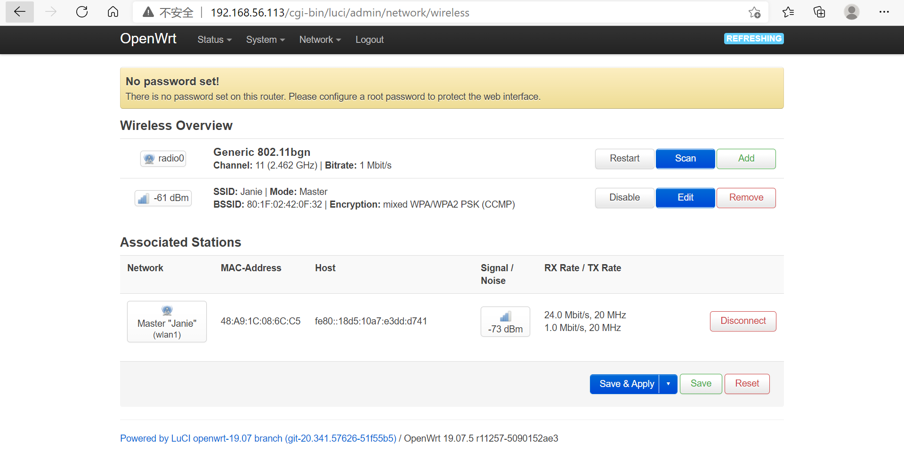


抓包结果如图：


15. 验证实验要求第一条里的功能清单

    - 重置和恢复AP到出厂默认设置状态 

      ```txt
      firstboot
      reboot
      ```

      

      出厂IP 为192.168.1.1，之前安装的包也不见了

      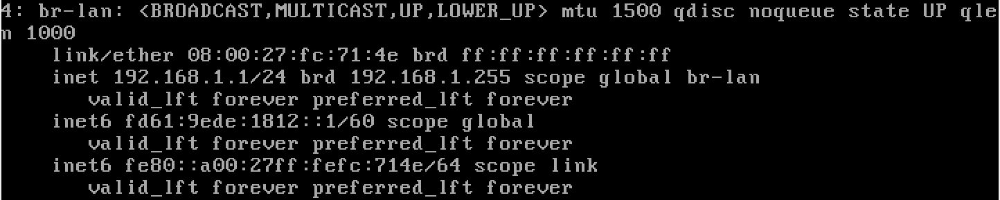

      

      

    - 设置AP的管理员用户名和密码

      之前没有密码，如图

      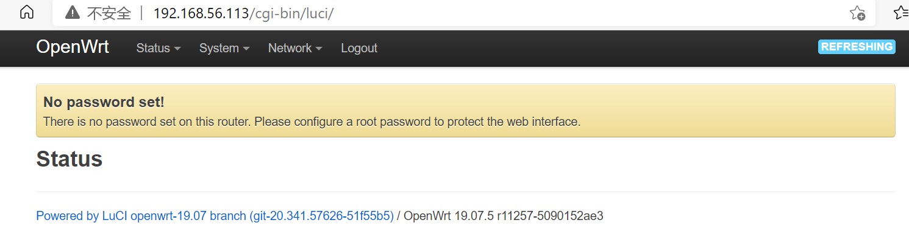

      在WEB页面里设置一个密码，如图

      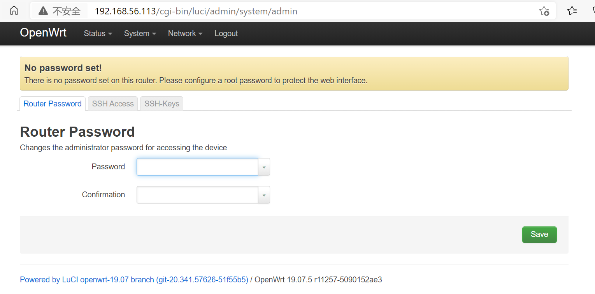

      再登陆WEB管理页面或者root SSH连接时必须输入这个密码

      

    - 设置SSID广播和非广播模式

      如图这里设置 是否 Hide ESSID

      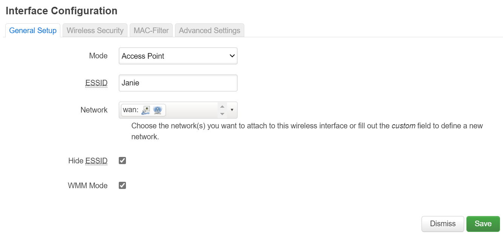

      

    - 配置不同的加密方式

      部分如14所示，Network - Wireless - Edit - Wireless Security设置加密方式

      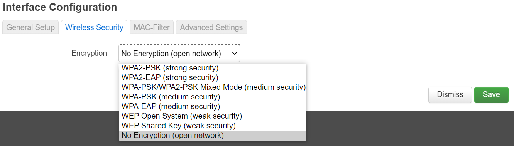

      

    - 设置AP管理密码

      见AP管理员用户密码，管理也是在这里设

      

    - 配置无线路由器使用自定义的DNS解析服务器

      在Network - DHCP and DNS里看，如图自定义DNS

      

    - 配置DHCP和禁用DHCP

      在Network - DHCP and DNS里看，如图

      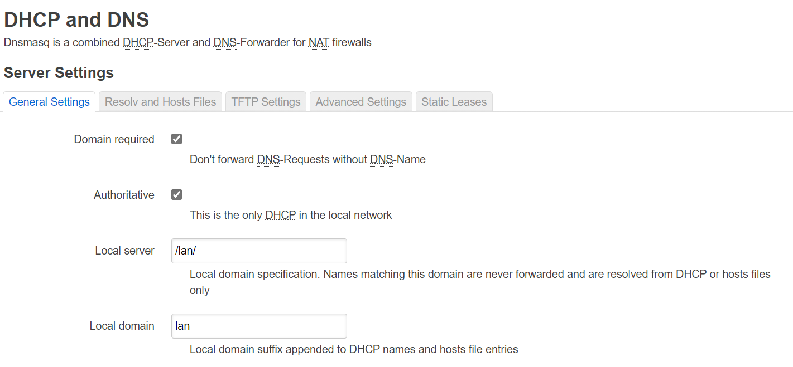

      

    - 开启路由器/AP的日志记录功能（对指定事件记录）

      在Status里可以看Syslog和kernel log, 如图

      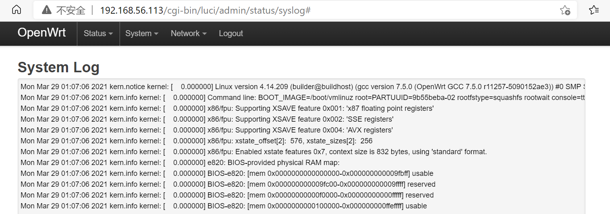

      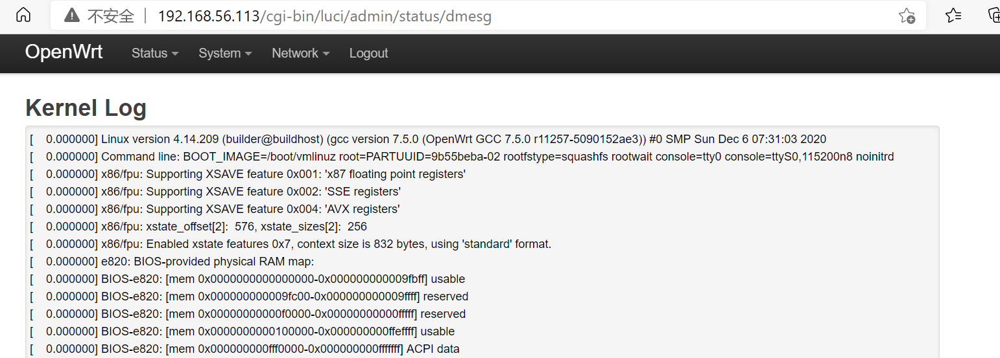

      部分事件可以手动设置记不记录进日志，例如DNS requests

      

      
    
    - 配置AP隔离(WLAN划分)功能
    
      参考[this](https://blog.csdn.net/hunningtu/article/details/52755520)，修改/etc/config/wireless配置文件，在wifi-iface配置段的适当位置添加：option isolate 1
    
      ```txt
      config wifi-iface 'default_radio0'
              option device 'radio0'
              option network 'lan'
              option mode 'ap'
              option ssid 'OpenWrt'
              option encryption 'none'
              option isolate 1
      ```
    
      
    
    - 设置MAC地址过滤规则（ACL地址过滤器）
    
      如图，在无线网络的设置里可以选择MAC地址过滤并设置ACL
    
      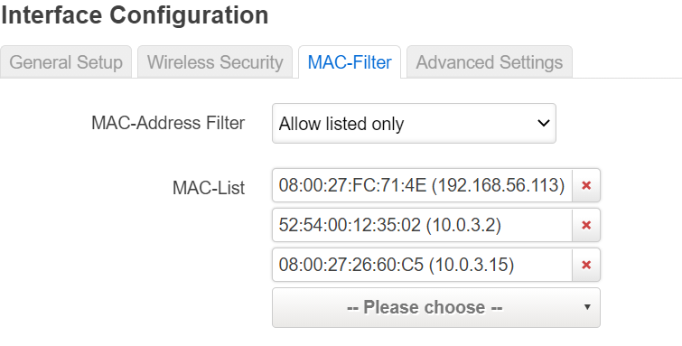
    
      
    
    - 查看WPS功能的支持情况
    
      参考[this](https://forum.openwrt.org/t/wps-on-off-in-luci/1046)，其实和原来的一致
    
      ```txt
      root@OpenWrt:~# opkg list-installed | grep wpad-mini
      root@OpenWrt:~# opkg list-installed | grep hostapd-mini
      root@OpenWrt:~# opkg list-installed | grep wpad
      root@OpenWrt:~# opkg list-installed | grep hostapd-utils
      root@OpenWrt:~# opkg find hostapd-utils
      hostapd-utils - 2019-08-08-ca8c2bd2-7 - This package contains a command line utility to control the
      IEEE 802.1x/WPA/EAP/RADIUS Authenticator.
      root@OpenWrt:~# opkg install hostapd-utils
    Installing hostapd-utils (2019-08-08-ca8c2bd2-7) to root...
      Downloading http://downloads.openwrt.org/releases/19.07.5/packages/x86_64/base/hostapd-utils_2019-08-08-ca8c2bd2-7_x86_64.ipk
    Configuring hostapd-utils.
      root@OpenWrt:~# opkg find wpad
    wpad - 2019-08-08-ca8c2bd2-7 - This package contains a full featured IEEE 802.1x/WPA/EAP/RADIUS
       Authenticator and Supplicant
      root@OpenWrt:~# opkg install wpad
      Installing wpad (2019-08-08-ca8c2bd2-7) to root...
      Collected errors:
       * check_conflicts_for: The following packages conflict with wpad:
       * check_conflicts_for:         hostapd *
       * opkg_install_cmd: Cannot install package wpad.
         root@OpenWrt:~# opkg remove hostapd
     Removing package hostapd from root...
         root@OpenWrt:~# opkg install wpad
         Installing wpad (2019-08-08-ca8c2bd2-7) to root...
         Downloading http://downloads.openwrt.org/releases/19.07.5/packages/x86_64/base/wpad_2019-08-08-ca8c2bd2-7_x86_64.ipk
         Collected errors:
       * check_data_file_clashes: Package wpad wants to install file /usr/sbin/wpa_supplicant
            But that file is already provided by package  * wpa-supplicant
       * opkg_install_cmd: Cannot install package wpad.
         root@OpenWrt:~# opkg remove wpa-supplicant
         Removing package wpa-supplicant from root...
         root@OpenWrt:~# opkg install wpad
         Installing wpad (2019-08-08-ca8c2bd2-7) to root...
         Downloading http://downloads.openwrt.org/releases/19.07.5/packages/x86_64/base/wpad_2019-08-08-ca8c2bd2-7_x86_64.ipk
         Configuring wpad.
      ```
    
      
    
      
    
    - 查看AP/无线路由器支持哪些工作模式
    
      参考[this](https://blog.csdn.net/luck_good/article/details/24047619)，查看配置wireless配置文件并修改mode为其他
    
      ```txt
      config wifi-iface 'default_radio0'
              option device 'radio0'
              option network 'lan'
              option mode 'ap'
              option ssid 'OpenWrt'
              option encryption 'none'
      ```
    
      