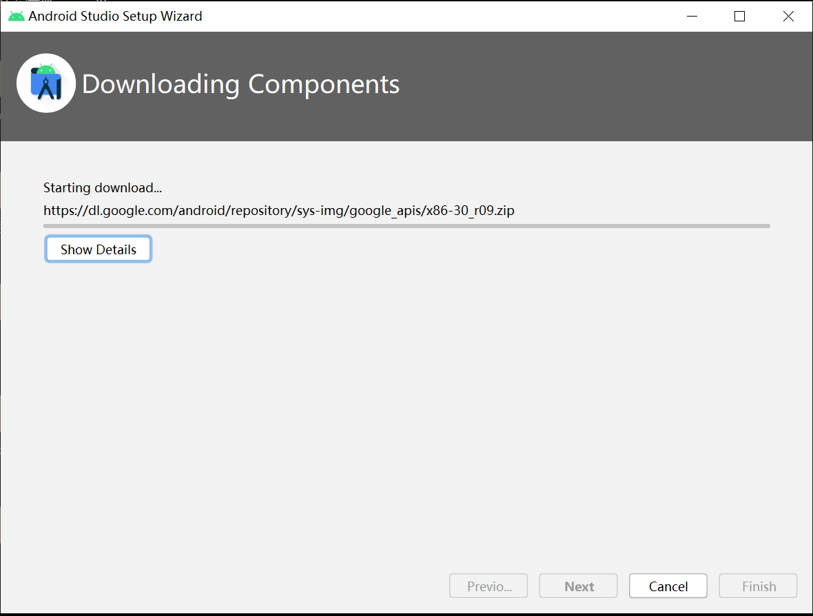
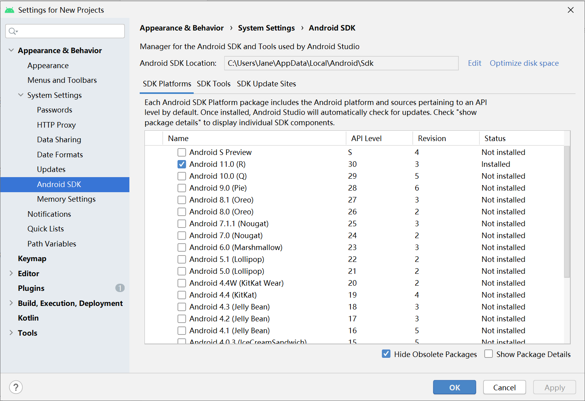
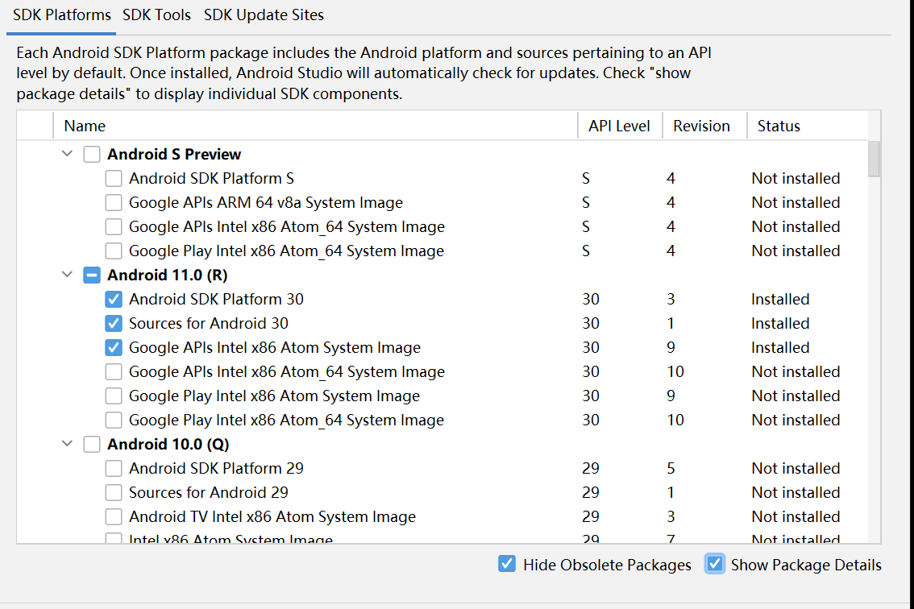
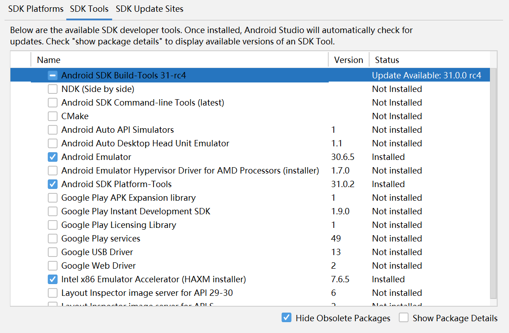
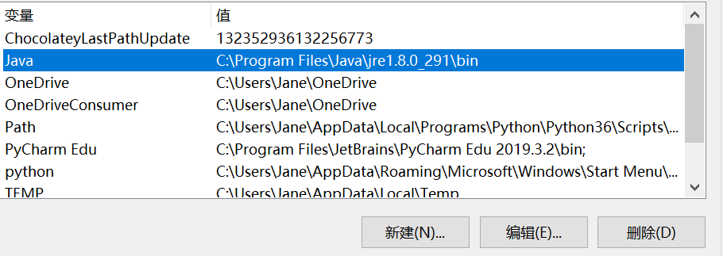

## 安装和配置 Java SDK

#### 安装Android Studio

- 通过官方网站下载[Android Studio](https://developer.android.com/studio/) 最新版本并根据提示安装

#### 下载安装并配置Andriod SDK

- 选择Standard（不是customed）SDK直接安装

  

  

- 启动页面SDK Manager，可以看安装的SDK

  

  

- 勾选 Show Package Details可以看具体下载什么系统组件

  

  

- 查看SDK Tools以选择不同的开发者工具下载安装，建议安装的Android 模拟器Intel x86 Emulator Accelerator (HAXM installer)已经安装好了

  


#### 配置Gradle编译环境

- 使用 Android Studio 的内置 gradle

  

## 遇到的问题

1. 安装Studio standard配置的时候，现实磁盘空间不足，安装中断

   - 退出Studio，卸载已经安装的Studio

   - 清理出足够的磁盘空间

   - 再次安装，成功

     

2. Terminal运行`gradlew -v`报错找不到Java，因为没安装过Java，查阅文档得知需要安装Java8以上，去安装并添加路径到环境变量即可

   

   ```txt
   # Win cmd
   C:\Users\Jane>java -version
   java version "1.8.0_291"
   Java(TM) SE Runtime Environment (build 1.8.0_291-b10)
   Java HotSpot(TM) 64-Bit Server VM (build 25.291-b10, mixed mode)
   ```

   

   ```txt
   # Andriod Studio Terminal
   C:\Users\Jane\Desktop\MyApplication>gradlew -v
   
   ERROR: JAVA_HOME is not set and no 'java' command could be found in your PATH.
   
   Please set the JAVA_HOME variable in your environment to match the
   location of your Java installation.
   C:\Users\Jane\Desktop\MyApplication>gradlew -v
   
   Welcome to Gradle 6.7.1!
   
   Here are the highlights of this release:
    - File system watching is ready for production use
    - Declare the version of Java your build requires
    - Java 15 support
   
   For more details see https://docs.gradle.org/6.7.1/release-notes.html
   
   
   ------------------------------------------------------------
   Gradle 6.7.1
   ------------------------------------------------------------
   
   Build time:   2020-11-16 17:09:24 UTC
   Revision:     2972ff02f3210d2ceed2f1ea880f026acfbab5c0
   
   Kotlin:       1.3.72
   Groovy:       2.5.12
   Ant:          Apache Ant(TM) version 1.10.8 compiled on May 10 2020
   JVM:          1.8.0_291 (Oracle Corporation 25.291-b10)
   OS:           Windows 10 10.0 amd64
   
   C:\Users\Jane\Desktop\MyApplication>
   
   ```

   

   