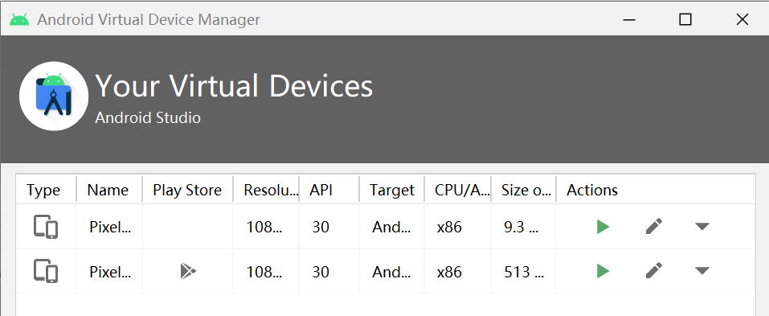
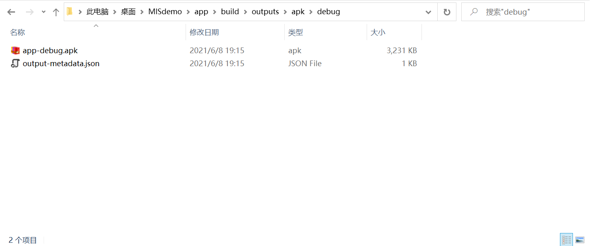

## ADB实验

#### Helloword v1

- 安装配置Andriod Studio（见[第五章实验报告]()）

- Create New Project -> Name: MISdemo -> Package name: cuc.edu.cn -> Language: Java -> Save

- 创建和查看创建好的模拟器AVD：Tools -> AVD Manager，已有Pixel_3a_API_30_x86；有根据[创建和管理虚拟设备  | Android 开发者  | Android Developers (google.cn)](https://developer.android.google.cn/studio/run/managing-avds#createavd)进行实践又安装上了一个AVD Pixel_3a_API_30

  

  

- 运行helloword程序，（遇到的问题和解决方案见“遇到的问题”小节），成功运行

  


- 将adb.exe加到系统的环境变量里，这样可以通过命令行执行`adb `的命令

  


#### 需要关注的问题

在代码编写和运行过程中，请特别关注以下问题：

- [x] 按照向导创建的工程在模拟器里运行成功的前提下，生成的APK文件在哪儿保存的？

  先打开并运行刚刚运行成功的hello world程序，打开命令行，`adb shell`连接到虚拟手机执行命令

  ```txt
  generic_x86_arm:/ $ pm path cuc.edu.cn
  package:/data/app/~~NkPjzHloX2SxMz0qauM9gQ==/cuc.edu.cn-PIm2RTSr9AfLeqSQBI5wDg==/base.apk
  generic_x86_arm:/ $
  ```

  [ref](https://stackoverflow.com/questions/2507960/does-android-keep-the-apk-files-if-so-where)

  生成的APK文件在连接到的AVD里的`/data/app/~~NkPjzHloX2SxMz0qauM9gQ==/cuc.edu.cn-PIm2RTSr9AfLeqSQBI5wDg==/base.apk`，可以用`adb pull /data/app/~~NkPjzHloX2SxMz0qauM9gQ==/cuc.edu.cn-PIm2RTSr9AfLeqSQBI5wDg==/base.apk`拷贝出来APK

  在这里本地项目目录里可以看见APK文件

  

  

- [x] 使用adb shell是否可以绕过MainActivity页面直接“唤起”第二个DisplayMessageActivity页面？是否可以在直接唤起的这个DisplayMessageActivity页面上显示自定义的一段文字，比如：你好移动互联网安全

  可以，指定activity的名字启动` am start -n cuc.edu.cn/cuc.edu.cn.DisplayMessageActivity`

  可以自定义文字。

  创建另一个Activity DisplayMessageActivity，DisplayMessageActivity.java放在和MainActivity.java同一目录下，并在manifest里加入这个新创建的Activity

  要自定义文字，创建一个TextView并将文字用setText放入

  ```txt
  import android.app.Activity;
  import android.os.Bundle;
  import android.support.v4.app.NavUtils;
  import android.view.MenuItem;
  import android.widget.TextView;
  
  public class DisplayMessageActivity extends Activity {
  
      @Override
      public void onCreate(Bundle savedInstanceState) {
          super.onCreate(savedInstanceState);
  
          String message = "Hellooooooo";
  
          // Create the text view
          TextView textView = new TextView(this);
          textView.setTextSize(40);
          textView.setText(message);
  
          // Set the text view as the activity layout
          setContentView(textview);
      }
  ```

  

- [x] 如何实现在真机上运行你开发的这个Hello World程序？

  首先，是在Windows上开发的，所以可能要先为设备安装合适的驱动程序；用USB线将真机连接到Windows开发机器；在开发者选项中启动USB调试，在真机上打开设置->（系统）->关于手机->点版本号7次->返回至上一屏点开发者选项->启用USB调试；在Android Studio中选择刚刚配好的真机设备 ->运行

  [运行应用  | Android 开发者  | Android Developers (google.cn)](https://developer.android.google.cn/training/basics/firstapp/running-app)

  

- [x] 如何修改代码实现通过 `adb shell am start -a android.intent.action.VIEW -d http://sec.cuc.edu.cn/` 可以让我们的cuc.edu.cn.misdemo程序出现在“用于打开浏览器的应用程序选择列表”？

  在Manifest文件中，给想要接收跳转的Activity添加配置，然后在 WebViewActivity 中获取相关传递数据

  

- [x] 如何修改应用程序默认图标？

  找到图标文件，替换图标图片，将AndroidManifest.xml中的icon换成替换图标图片的名字

  

  

  

- [x] 如何修改代码使得应用程序图标在手机主屏幕上实现隐藏？

  在menifests/AndroidMenifests.xml里修改
  
  ```txt
    # default 原来的
    <activity android:name=".MainActivity">
              <intent-filter>
                  <action android:name="android.intent.action.MAIN" />
  
                  <category android:name="android.intent.category.LAUNCHER" />
              </intent-filter>
          </activity>
          
    # 改成
    <activity android:name=".MainActivity">
          <intent-filter>
              <action android:name="android.intent.action.MAIN" />
              <category android:name="android.intent.category.LEANBACK_LAUNCHER"/>
          </intent-filter>
      </activity>
  ```
  
  并且在Manifest 标签里加入 uses-features
  
  ```
  <uses-feature
      android:name="android.software.leanback"
      android:required="true" />
  ```
  
  

#### 遇到的问题

- 所有AVD都启动不了，报错`The emulator process for AVD Pixel_3a_API_30_x86 was killed.`，没有更具体的报错了

```txt
# Run
06/08 12:27:08: Launching 'app' on Pixel_3a_API_30_x86.
Error while waiting for device: The emulator process for AVD Pixel_3a_API_30_x86 was killed.


# 破案了，原来因为没有地方看到底为什么被杀死，解决方案众多眼花缭乱。
# 用这个方法查找到了被杀死的详细原因：至少还需要3GB的磁盘空间
Microsoft Windows [版本 10.0.19042.985]
(c) Microsoft Corporation。保留所有权利。

C:\Users\Jane>cd C:\Users\Jane\AppData\Local\Android\Sdk\emulator

C:\Users\Jane\AppData\Local\Android\Sdk\emulator>emulater -list-avds
'emulater' 不是内部或外部命令，也不是可运行的程序
或批处理文件。

C:\Users\Jane\AppData\Local\Android\Sdk\emulator>emulator -list-avds
Pixel_3_API_30
Pixel_3a_API_30_x86

C:\Users\Jane\AppData\Local\Android\Sdk\emulator>emulator -avd Pixel_3_API_30
emulator: Android emulator version 30.6.5.0 (build_id 7324830) (CL:N/A)
emulator: ERROR: Not enough space to create userdata partition. Available: 4305.589844 MB at C:\Users\Jane\.android\avd\Pixel_3_API_30.avd, need 7372.800000 MB.


C:\Users\Jane\AppData\Local\Android\Sdk\emulator>
```

[参考解决方案-Evensgelist](https://stackoverflow.com/questions/63317727/android-emulator-the-emulator-process-for-avd-was-killed-windows-intel)

释放约3GB的磁盘空间，再次运行，成功！


