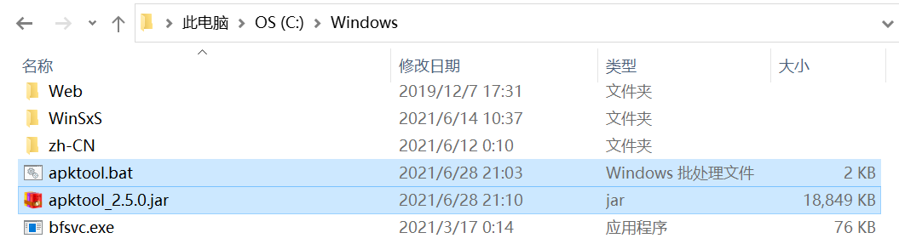
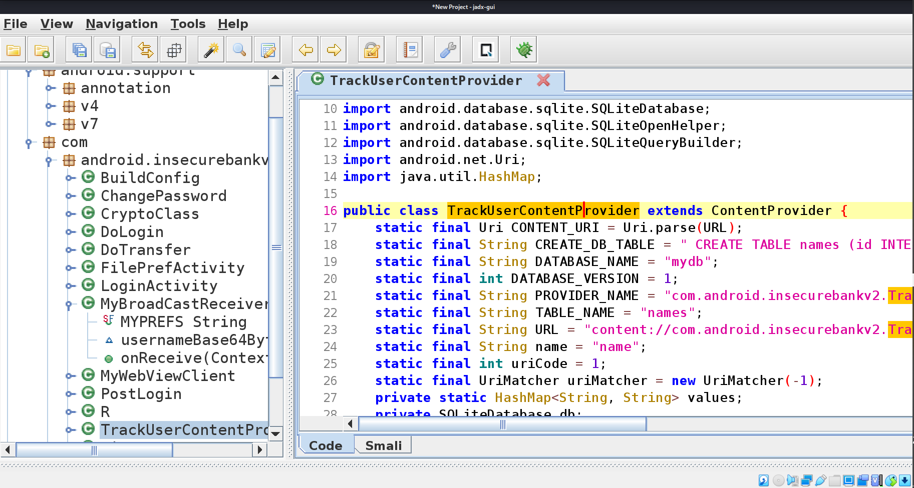

# 实验八-期末


## Developer Backdoor

- 从[Loonyluna12345/Android-InsecureBankv2: Vulnerable Android application for developers and security enthusiasts to learn about Android insecurities (github.com)](https://github.com/Loonyluna12345/Android-InsecureBankv2)下载InsecureBankv2.apk

- 从[Java SE Development Kit 11- - Downloads (oracle.com)](https://www.oracle.com/java/technologies/javase-jdk11-downloads.html)下载JDK11，并参照[Kali Linux 下java环境（jdk）的安装_OverJerry_OverJerry的博客-CSDN博客_kali安装jdk](https://blog.csdn.net/weixin_41732074/article/details/84679138)配置

- 文档提供网址失效，从[dex2jar](https://github.com/pxb1988/dex2jar)下载dex2jar

- `git clone https://github.com/skylot/jadx.git`下载jadx，准备源码安装

  

- 将classes.dex拷贝到 dex2jar-2.0文件夹

- 为了使得d2j-dex2jar.sh和d2j_invoke.sh可以跑，执行以下命令：

  ```txt
  chmod +x d2j-dex2jar.sh
  chmod +x d2j_invoke.sh
  ```

- `sh d2j-dex2jar.sh classes.dex`将dex文件变成jar文件

  

- 参照[skylot/jadx: Dex to Java decompiler (github.com)](https://github.com/skylot/jadx)源码安装jadx

  ```txt
  cd jadx
  ./gradlew dist
  ```

- 用刚刚配置好的JADX-GUI反编译 classes-dex2jar.jar

   `./jadx-gui /home/kali/Desktop/dex2jar-2.0/classes-dex2jar.jar `

- 找到developer backdoor，在DoLogin文件中。用户名`devadmin`可以用任何无效密码登陆

  
  
  
  
  

```txt
# Develop Backdoor实验附录，后面部分具体操作步骤和输出的结果（命令行能存的有限）

root@kali:/home/kali/Desktop# tar -xzvf jdk-11.0.11_linux-x64_bin.tar.gz 
jdk-11.0.11/README.html
jdk-11.0.11/bin/jaotc
jdk-11.0.11/bin/jar
jdk-11.0.11/bin/jarsigner
jdk-11.0.11/bin/java
jdk-11.0.11/bin/javac
jdk-11.0.11/bin/javadoc
jdk-11.0.11/bin/javap
jdk-11.0.11/bin/jcmd
jdk-11.0.11/bin/jconsole
jdk-11.0.11/bin/jdb
jdk-11.0.11/bin/jdeprscan
jdk-11.0.11/bin/jdeps
jdk-11.0.11/bin/jfr
jdk-11.0.11/bin/jhsdb
jdk-11.0.11/bin/jimage
jdk-11.0.11/bin/jinfo
jdk-11.0.11/bin/jjs
jdk-11.0.11/bin/jlink
jdk-11.0.11/bin/jmap
jdk-11.0.11/bin/jmod
jdk-11.0.11/bin/jps
jdk-11.0.11/bin/jrunscript
jdk-11.0.11/bin/jshell
jdk-11.0.11/bin/jstack
jdk-11.0.11/bin/jstat
jdk-11.0.11/bin/jstatd
jdk-11.0.11/bin/keytool
jdk-11.0.11/bin/pack200
jdk-11.0.11/bin/rmic
jdk-11.0.11/bin/rmid
jdk-11.0.11/bin/rmiregistry
jdk-11.0.11/bin/serialver
jdk-11.0.11/bin/unpack200
jdk-11.0.11/conf/logging.properties
jdk-11.0.11/conf/management/jmxremote.access
jdk-11.0.11/conf/management/jmxremote.password.template
jdk-11.0.11/conf/management/management.properties
jdk-11.0.11/conf/net.properties
jdk-11.0.11/conf/security/java.policy
jdk-11.0.11/conf/security/java.security
jdk-11.0.11/conf/security/policy/README.txt
jdk-11.0.11/conf/security/policy/limited/default_US_export.policy
jdk-11.0.11/conf/security/policy/limited/default_local.policy
jdk-11.0.11/conf/security/policy/limited/exempt_local.policy
jdk-11.0.11/conf/security/policy/unlimited/default_US_export.policy
jdk-11.0.11/conf/security/policy/unlimited/default_local.policy
jdk-11.0.11/conf/sound.properties
jdk-11.0.11/include/classfile_constants.h
jdk-11.0.11/include/jawt.h
jdk-11.0.11/include/jdwpTransport.h
jdk-11.0.11/include/jni.h
jdk-11.0.11/include/jvmti.h
jdk-11.0.11/include/jvmticmlr.h
jdk-11.0.11/include/linux/jawt_md.h
jdk-11.0.11/include/linux/jni_md.h
jdk-11.0.11/jmods/java.base.jmod
jdk-11.0.11/jmods/java.compiler.jmod
jdk-11.0.11/jmods/java.datatransfer.jmod
jdk-11.0.11/jmods/java.desktop.jmod
jdk-11.0.11/jmods/java.instrument.jmod
jdk-11.0.11/jmods/java.logging.jmod
jdk-11.0.11/jmods/java.management.jmod
jdk-11.0.11/jmods/java.management.rmi.jmod
jdk-11.0.11/jmods/java.naming.jmod
jdk-11.0.11/jmods/java.net.http.jmod
jdk-11.0.11/jmods/java.prefs.jmod
jdk-11.0.11/jmods/java.rmi.jmod
jdk-11.0.11/jmods/java.scripting.jmod
jdk-11.0.11/jmods/java.se.jmod
jdk-11.0.11/jmods/java.security.jgss.jmod
jdk-11.0.11/jmods/java.security.sasl.jmod
jdk-11.0.11/jmods/java.smartcardio.jmod
jdk-11.0.11/jmods/java.sql.jmod
jdk-11.0.11/jmods/java.sql.rowset.jmod
jdk-11.0.11/jmods/java.transaction.xa.jmod
jdk-11.0.11/jmods/java.xml.crypto.jmod
jdk-11.0.11/jmods/java.xml.jmod
jdk-11.0.11/jmods/jdk.accessibility.jmod
jdk-11.0.11/jmods/jdk.aot.jmod
jdk-11.0.11/jmods/jdk.attach.jmod
jdk-11.0.11/jmods/jdk.charsets.jmod
jdk-11.0.11/jmods/jdk.compiler.jmod
jdk-11.0.11/jmods/jdk.crypto.cryptoki.jmod
jdk-11.0.11/jmods/jdk.crypto.ec.jmod
jdk-11.0.11/jmods/jdk.dynalink.jmod
jdk-11.0.11/jmods/jdk.editpad.jmod
jdk-11.0.11/jmods/jdk.hotspot.agent.jmod
jdk-11.0.11/jmods/jdk.httpserver.jmod
jdk-11.0.11/jmods/jdk.internal.ed.jmod
jdk-11.0.11/jmods/jdk.internal.jvmstat.jmod
jdk-11.0.11/jmods/jdk.internal.le.jmod
jdk-11.0.11/jmods/jdk.internal.opt.jmod
jdk-11.0.11/jmods/jdk.internal.vm.ci.jmod
jdk-11.0.11/jmods/jdk.internal.vm.compiler.jmod
jdk-11.0.11/jmods/jdk.internal.vm.compiler.management.jmod
jdk-11.0.11/jmods/jdk.jartool.jmod
jdk-11.0.11/jmods/jdk.javadoc.jmod
jdk-11.0.11/jmods/jdk.jcmd.jmod
jdk-11.0.11/jmods/jdk.jconsole.jmod
jdk-11.0.11/jmods/jdk.jdeps.jmod
jdk-11.0.11/jmods/jdk.jdi.jmod
jdk-11.0.11/jmods/jdk.jdwp.agent.jmod
jdk-11.0.11/jmods/jdk.jfr.jmod
jdk-11.0.11/jmods/jdk.jlink.jmod
jdk-11.0.11/jmods/jdk.jshell.jmod
jdk-11.0.11/jmods/jdk.jsobject.jmod
jdk-11.0.11/jmods/jdk.jstatd.jmod
jdk-11.0.11/jmods/jdk.localedata.jmod
jdk-11.0.11/jmods/jdk.management.agent.jmod
jdk-11.0.11/jmods/jdk.management.jfr.jmod
jdk-11.0.11/jmods/jdk.management.jmod
jdk-11.0.11/jmods/jdk.naming.dns.jmod
jdk-11.0.11/jmods/jdk.naming.ldap.jmod
jdk-11.0.11/jmods/jdk.naming.rmi.jmod
jdk-11.0.11/jmods/jdk.net.jmod
jdk-11.0.11/jmods/jdk.pack.jmod
jdk-11.0.11/jmods/jdk.rmic.jmod
jdk-11.0.11/jmods/jdk.scripting.nashorn.jmod
jdk-11.0.11/jmods/jdk.scripting.nashorn.shell.jmod
jdk-11.0.11/jmods/jdk.sctp.jmod
jdk-11.0.11/jmods/jdk.security.auth.jmod
jdk-11.0.11/jmods/jdk.security.jgss.jmod
jdk-11.0.11/jmods/jdk.unsupported.desktop.jmod
jdk-11.0.11/jmods/jdk.unsupported.jmod
jdk-11.0.11/jmods/jdk.xml.dom.jmod
jdk-11.0.11/jmods/jdk.zipfs.jmod
jdk-11.0.11/legal/java.base/COPYRIGHT
jdk-11.0.11/legal/java.base/LICENSE
jdk-11.0.11/legal/java.base/aes.md
jdk-11.0.11/legal/java.base/asm.md
jdk-11.0.11/legal/java.base/c-libutl.md
jdk-11.0.11/legal/java.base/cldr.md
jdk-11.0.11/legal/java.base/icu.md
jdk-11.0.11/legal/java.base/public_suffix.md
jdk-11.0.11/legal/java.base/unicode.md
jdk-11.0.11/legal/java.compiler/COPYRIGHT
jdk-11.0.11/legal/java.compiler/LICENSE
jdk-11.0.11/legal/java.datatransfer/COPYRIGHT
jdk-11.0.11/legal/java.datatransfer/LICENSE
jdk-11.0.11/legal/java.desktop/COPYRIGHT
jdk-11.0.11/legal/java.desktop/LICENSE
jdk-11.0.11/legal/java.desktop/colorimaging.md
jdk-11.0.11/legal/java.desktop/giflib.md
jdk-11.0.11/legal/java.desktop/harfbuzz.md
jdk-11.0.11/legal/java.desktop/jpeg.md
jdk-11.0.11/legal/java.desktop/lcms.md
jdk-11.0.11/legal/java.desktop/libpng.md
jdk-11.0.11/legal/java.desktop/mesa3d.md
jdk-11.0.11/legal/java.desktop/xwd.md
jdk-11.0.11/legal/java.instrument/COPYRIGHT
jdk-11.0.11/legal/java.instrument/LICENSE
jdk-11.0.11/legal/java.logging/COPYRIGHT
jdk-11.0.11/legal/java.logging/LICENSE
jdk-11.0.11/legal/java.management.rmi/COPYRIGHT
jdk-11.0.11/legal/java.management.rmi/LICENSE
jdk-11.0.11/legal/java.management/COPYRIGHT
jdk-11.0.11/legal/java.management/LICENSE
jdk-11.0.11/legal/java.naming/COPYRIGHT
jdk-11.0.11/legal/java.naming/LICENSE
jdk-11.0.11/legal/java.net.http/COPYRIGHT
jdk-11.0.11/legal/java.net.http/LICENSE
jdk-11.0.11/legal/java.prefs/COPYRIGHT
jdk-11.0.11/legal/java.prefs/LICENSE
jdk-11.0.11/legal/java.rmi/COPYRIGHT
jdk-11.0.11/legal/java.rmi/LICENSE
jdk-11.0.11/legal/java.scripting/COPYRIGHT
jdk-11.0.11/legal/java.scripting/LICENSE
jdk-11.0.11/legal/java.se/COPYRIGHT
jdk-11.0.11/legal/java.se/LICENSE
jdk-11.0.11/legal/java.security.jgss/COPYRIGHT
jdk-11.0.11/legal/java.security.jgss/LICENSE
jdk-11.0.11/legal/java.security.sasl/COPYRIGHT
jdk-11.0.11/legal/java.security.sasl/LICENSE
jdk-11.0.11/legal/java.smartcardio/COPYRIGHT
jdk-11.0.11/legal/java.smartcardio/LICENSE
jdk-11.0.11/legal/java.smartcardio/pcsclite.md
jdk-11.0.11/legal/java.sql.rowset/COPYRIGHT
jdk-11.0.11/legal/java.sql.rowset/LICENSE
jdk-11.0.11/legal/java.sql/COPYRIGHT
jdk-11.0.11/legal/java.sql/LICENSE
jdk-11.0.11/legal/java.transaction.xa/COPYRIGHT
jdk-11.0.11/legal/java.transaction.xa/LICENSE
jdk-11.0.11/legal/java.xml.crypto/COPYRIGHT
jdk-11.0.11/legal/java.xml.crypto/LICENSE
jdk-11.0.11/legal/java.xml.crypto/santuario.md
jdk-11.0.11/legal/java.xml/COPYRIGHT
jdk-11.0.11/legal/java.xml/LICENSE
jdk-11.0.11/legal/java.xml/bcel.md
jdk-11.0.11/legal/java.xml/dom.md
jdk-11.0.11/legal/java.xml/jcup.md
jdk-11.0.11/legal/java.xml/xalan.md
jdk-11.0.11/legal/java.xml/xerces.md
jdk-11.0.11/legal/jdk.accessibility/COPYRIGHT
jdk-11.0.11/legal/jdk.accessibility/LICENSE
jdk-11.0.11/legal/jdk.aot/COPYRIGHT
jdk-11.0.11/legal/jdk.aot/LICENSE
jdk-11.0.11/legal/jdk.attach/COPYRIGHT
jdk-11.0.11/legal/jdk.attach/LICENSE
jdk-11.0.11/legal/jdk.charsets/COPYRIGHT
jdk-11.0.11/legal/jdk.charsets/LICENSE
jdk-11.0.11/legal/jdk.compiler/COPYRIGHT
jdk-11.0.11/legal/jdk.compiler/LICENSE
jdk-11.0.11/legal/jdk.crypto.cryptoki/COPYRIGHT
jdk-11.0.11/legal/jdk.crypto.cryptoki/LICENSE
jdk-11.0.11/legal/jdk.crypto.cryptoki/pkcs11cryptotoken.md
jdk-11.0.11/legal/jdk.crypto.cryptoki/pkcs11wrapper.md
jdk-11.0.11/legal/jdk.crypto.ec/COPYRIGHT
jdk-11.0.11/legal/jdk.crypto.ec/LICENSE
jdk-11.0.11/legal/jdk.crypto.ec/ecc.md
jdk-11.0.11/legal/jdk.dynalink/COPYRIGHT
jdk-11.0.11/legal/jdk.dynalink/LICENSE
jdk-11.0.11/legal/jdk.dynalink/dynalink.md
jdk-11.0.11/legal/jdk.editpad/COPYRIGHT
jdk-11.0.11/legal/jdk.editpad/LICENSE
jdk-11.0.11/legal/jdk.hotspot.agent/COPYRIGHT
jdk-11.0.11/legal/jdk.hotspot.agent/LICENSE
jdk-11.0.11/legal/jdk.httpserver/COPYRIGHT
jdk-11.0.11/legal/jdk.httpserver/LICENSE
jdk-11.0.11/legal/jdk.internal.ed/COPYRIGHT
jdk-11.0.11/legal/jdk.internal.ed/LICENSE
jdk-11.0.11/legal/jdk.internal.jvmstat/COPYRIGHT
jdk-11.0.11/legal/jdk.internal.jvmstat/LICENSE
jdk-11.0.11/legal/jdk.internal.le/COPYRIGHT
jdk-11.0.11/legal/jdk.internal.le/LICENSE
jdk-11.0.11/legal/jdk.internal.le/jline.md
jdk-11.0.11/legal/jdk.internal.opt/COPYRIGHT
jdk-11.0.11/legal/jdk.internal.opt/LICENSE
jdk-11.0.11/legal/jdk.internal.opt/jopt-simple.md
jdk-11.0.11/legal/jdk.internal.vm.ci/COPYRIGHT
jdk-11.0.11/legal/jdk.internal.vm.ci/LICENSE
jdk-11.0.11/legal/jdk.internal.vm.compiler.management/COPYRIGHT
jdk-11.0.11/legal/jdk.internal.vm.compiler.management/LICENSE
jdk-11.0.11/legal/jdk.internal.vm.compiler/COPYRIGHT
jdk-11.0.11/legal/jdk.internal.vm.compiler/LICENSE
jdk-11.0.11/legal/jdk.jartool/COPYRIGHT
jdk-11.0.11/legal/jdk.jartool/LICENSE
jdk-11.0.11/legal/jdk.javadoc/COPYRIGHT
jdk-11.0.11/legal/jdk.javadoc/LICENSE
jdk-11.0.11/legal/jdk.javadoc/jquery.md
jdk-11.0.11/legal/jdk.javadoc/jqueryUI.md
jdk-11.0.11/legal/jdk.javadoc/jszip.md
jdk-11.0.11/legal/jdk.javadoc/pako.md
jdk-11.0.11/legal/jdk.jcmd/COPYRIGHT
jdk-11.0.11/legal/jdk.jcmd/LICENSE
jdk-11.0.11/legal/jdk.jconsole/COPYRIGHT
jdk-11.0.11/legal/jdk.jconsole/LICENSE
jdk-11.0.11/legal/jdk.jdeps/COPYRIGHT
jdk-11.0.11/legal/jdk.jdeps/LICENSE
jdk-11.0.11/legal/jdk.jdi/COPYRIGHT
jdk-11.0.11/legal/jdk.jdi/LICENSE
jdk-11.0.11/legal/jdk.jdwp.agent/COPYRIGHT
jdk-11.0.11/legal/jdk.jdwp.agent/LICENSE
jdk-11.0.11/legal/jdk.jfr/COPYRIGHT
jdk-11.0.11/legal/jdk.jfr/LICENSE
jdk-11.0.11/legal/jdk.jlink/COPYRIGHT
jdk-11.0.11/legal/jdk.jlink/LICENSE
jdk-11.0.11/legal/jdk.jshell/COPYRIGHT
jdk-11.0.11/legal/jdk.jshell/LICENSE
jdk-11.0.11/legal/jdk.jsobject/COPYRIGHT
jdk-11.0.11/legal/jdk.jsobject/LICENSE
jdk-11.0.11/legal/jdk.jstatd/COPYRIGHT
jdk-11.0.11/legal/jdk.jstatd/LICENSE
jdk-11.0.11/legal/jdk.localedata/COPYRIGHT
jdk-11.0.11/legal/jdk.localedata/LICENSE
jdk-11.0.11/legal/jdk.localedata/cldr.md
jdk-11.0.11/legal/jdk.localedata/thaidict.md
jdk-11.0.11/legal/jdk.management.agent/COPYRIGHT
jdk-11.0.11/legal/jdk.management.agent/LICENSE
jdk-11.0.11/legal/jdk.management.jfr/COPYRIGHT
jdk-11.0.11/legal/jdk.management.jfr/LICENSE
jdk-11.0.11/legal/jdk.management/COPYRIGHT
jdk-11.0.11/legal/jdk.management/LICENSE
jdk-11.0.11/legal/jdk.naming.dns/COPYRIGHT
jdk-11.0.11/legal/jdk.naming.dns/LICENSE
jdk-11.0.11/legal/jdk.naming.ldap/COPYRIGHT
jdk-11.0.11/legal/jdk.naming.ldap/LICENSE
jdk-11.0.11/legal/jdk.naming.rmi/COPYRIGHT
jdk-11.0.11/legal/jdk.naming.rmi/LICENSE
jdk-11.0.11/legal/jdk.net/COPYRIGHT
jdk-11.0.11/legal/jdk.net/LICENSE
jdk-11.0.11/legal/jdk.pack/COPYRIGHT
jdk-11.0.11/legal/jdk.pack/LICENSE
jdk-11.0.11/legal/jdk.rmic/COPYRIGHT
jdk-11.0.11/legal/jdk.rmic/LICENSE
jdk-11.0.11/legal/jdk.scripting.nashorn.shell/COPYRIGHT
jdk-11.0.11/legal/jdk.scripting.nashorn.shell/LICENSE
jdk-11.0.11/legal/jdk.scripting.nashorn/COPYRIGHT
jdk-11.0.11/legal/jdk.scripting.nashorn/LICENSE
jdk-11.0.11/legal/jdk.scripting.nashorn/double-conversion.md
jdk-11.0.11/legal/jdk.scripting.nashorn/joni.md
jdk-11.0.11/legal/jdk.sctp/COPYRIGHT
jdk-11.0.11/legal/jdk.sctp/LICENSE
jdk-11.0.11/legal/jdk.security.auth/COPYRIGHT
jdk-11.0.11/legal/jdk.security.auth/LICENSE
jdk-11.0.11/legal/jdk.security.jgss/COPYRIGHT
jdk-11.0.11/legal/jdk.security.jgss/LICENSE
jdk-11.0.11/legal/jdk.unsupported.desktop/COPYRIGHT
jdk-11.0.11/legal/jdk.unsupported.desktop/LICENSE
jdk-11.0.11/legal/jdk.unsupported/COPYRIGHT
jdk-11.0.11/legal/jdk.unsupported/LICENSE
jdk-11.0.11/legal/jdk.xml.dom/COPYRIGHT
jdk-11.0.11/legal/jdk.xml.dom/LICENSE
jdk-11.0.11/legal/jdk.zipfs/COPYRIGHT
jdk-11.0.11/legal/jdk.zipfs/LICENSE
jdk-11.0.11/lib/classlist
jdk-11.0.11/lib/ct.sym
jdk-11.0.11/lib/jexec
jdk-11.0.11/lib/jfr/default.jfc
jdk-11.0.11/lib/jfr/profile.jfc
jdk-11.0.11/lib/jli/libjli.so
jdk-11.0.11/lib/jrt-fs.jar
jdk-11.0.11/lib/jspawnhelper
jdk-11.0.11/lib/jvm.cfg
jdk-11.0.11/lib/libattach.so
jdk-11.0.11/lib/libawt.so
jdk-11.0.11/lib/libawt_headless.so
jdk-11.0.11/lib/libawt_xawt.so
jdk-11.0.11/lib/libdt_socket.so
jdk-11.0.11/lib/libextnet.so
jdk-11.0.11/lib/libfontmanager.so
jdk-11.0.11/lib/libharfbuzz.so
jdk-11.0.11/lib/libinstrument.so
jdk-11.0.11/lib/libj2gss.so
jdk-11.0.11/lib/libj2pcsc.so
jdk-11.0.11/lib/libj2pkcs11.so
jdk-11.0.11/lib/libjaas.so
jdk-11.0.11/lib/libjava.so
jdk-11.0.11/lib/libjavajpeg.so
jdk-11.0.11/lib/libjawt.so
jdk-11.0.11/lib/libjdwp.so
jdk-11.0.11/lib/libjimage.so
jdk-11.0.11/lib/libjsig.so
jdk-11.0.11/lib/libjsound.so
jdk-11.0.11/lib/liblcms.so
jdk-11.0.11/lib/libmanagement.so
jdk-11.0.11/lib/libmanagement_agent.so
jdk-11.0.11/lib/libmanagement_ext.so
jdk-11.0.11/lib/libmlib_image.so
jdk-11.0.11/lib/libnet.so
jdk-11.0.11/lib/libnio.so
jdk-11.0.11/lib/libprefs.so
jdk-11.0.11/lib/librmi.so
jdk-11.0.11/lib/libsaproc.so
jdk-11.0.11/lib/libsctp.so
jdk-11.0.11/lib/libsplashscreen.so
jdk-11.0.11/lib/libsunec.so
jdk-11.0.11/lib/libunpack.so
jdk-11.0.11/lib/libverify.so
jdk-11.0.11/lib/libzip.so
jdk-11.0.11/lib/modules
jdk-11.0.11/lib/psfont.properties.ja
jdk-11.0.11/lib/psfontj2d.properties
jdk-11.0.11/lib/security/blacklisted.certs
jdk-11.0.11/lib/security/cacerts
jdk-11.0.11/lib/security/default.policy
jdk-11.0.11/lib/security/public_suffix_list.dat
jdk-11.0.11/lib/server/Xusage.txt
jdk-11.0.11/lib/server/libjsig.so
jdk-11.0.11/lib/server/libjvm.so
jdk-11.0.11/lib/src.zip
jdk-11.0.11/lib/tzdb.dat
jdk-11.0.11/release
root@kali:/home/kali/Desktop# cd jdk-11.0.11
root@kali:/home/kali/Desktop/jdk-11.0.11# ls
bin  conf  include  jmods  legal  lib  README.html  release
root@kali:/home/kali/Desktop/jdk-11.0.11# vim ~/.bashrc
root@kali:/home/kali/Desktop/jdk-11.0.11# source ~/.bashrc
root@kali:/home/kali/Desktop/jdk-11.0.11# update-alternatives --install /usr/bin/java java /home/kali/Desktop/jdk-11.0.11/bin/java 1
root@kali:/home/kali/Desktop/jdk-11.0.11# update-alternatives --install /usr/bin/javac javac /home/kali/Desktop/jdk-11.0.11/bin/javac 1
update-alternatives: using /home/kali/Desktop/jdk-11.0.11/bin/javac to provide /usr/bin/javac (javac) in auto mode           
root@kali:/home/kali/Desktop/jdk-11.0.11# update-alternatives --set java /home/kali/Desktop/jdk-11.0.11/bin/java          
update-alternatives: using /home/kali/Desktop/jdk-11.0.11/bin/java to provide /usr/bin/java (java) in manual mode
root@kali:/home/kali/Desktop/jdk-11.0.11# update-alternatives --set javac /home/kali/Desktop/jdk-11.0.11/bin/javac
root@kali:/home/kali/Desktop/jdk-11.0.11# cd ..
root@kali:/home/kali/Desktop# java
Usage: java [options] <mainclass> [args...]
           (to execute a class)
   or  java [options] -jar <jarfile> [args...]
           (to execute a jar file)
   or  java [options] -m <module>[/<mainclass>] [args...]
       java [options] --module <module>[/<mainclass>] [args...]
           (to execute the main class in a module)
   or  java [options] <sourcefile> [args]
           (to execute a single source-file program)

 Arguments following the main class, source file, -jar <jarfile>,
 -m or --module <module>/<mainclass> are passed as the arguments to
 main class.

 where options include:

    -cp <class search path of directories and zip/jar files>
    -classpath <class search path of directories and zip/jar files>
    --class-path <class search path of directories and zip/jar files>
                  A : separated list of directories, JAR archives,
                  and ZIP archives to search for class files.
    -p <module path>
    --module-path <module path>...
                  A : separated list of directories, each directory
                  is a directory of modules.
    --upgrade-module-path <module path>...
                  A : separated list of directories, each directory
                  is a directory of modules that replace upgradeable
                  modules in the runtime image
--add-modules <module name>[,<module name>...]
                  root modules to resolve in addition to the initial module.
                  <module name> can also be ALL-DEFAULT, ALL-SYSTEM,
                  ALL-MODULE-PATH.
    --list-modules
                  list observable modules and exit
    -d <module name>
    --describe-module <module name>
                  describe a module and exit
    --dry-run     create VM and load main class but do not execute main method.
                  The --dry-run option may be useful for validating the
                  command-line options such as the module system configuration.
    --validate-modules
                  validate all modules and exit
                  The --validate-modules option may be useful for finding
                  conflicts and other errors with modules on the module path.
    -D<name>=<value>
                  set a system property
    -verbose:[class|module|gc|jni]
                  enable verbose output
    -version      print product version to the error stream and exit
    --version     print product version to the output stream and exit
    -showversion  print product version to the error stream and continue
    --show-version
                  print product version to the output stream and continue
    --show-module-resolution
                  show module resolution output during startup
    -? -h -help
                  print this help message to the error stream
    --help        print this help message to the output stream
    -X            print help on extra options to the error stream
    --help-extra  print help on extra options to the output stream
    -ea[:<packagename>...|:<classname>]
    -enableassertions[:<packagename>...|:<classname>]
                  enable assertions with specified granularity
    -da[:<packagename>...|:<classname>]
    -disableassertions[:<packagename>...|:<classname>]
                  disable assertions with specified granularity
    -esa | -enablesystemassertions
                  enable system assertions
    -dsa | -disablesystemassertions
                  disable system assertions
    -agentlib:<libname>[=<options>]
                  load native agent library <libname>, e.g. -agentlib:jdwp
                  see also -agentlib:jdwp=help
    -agentpath:<pathname>[=<options>]
                  load native agent library by full pathname
    -javaagent:<jarpath>[=<options>]
                  load Java programming language agent, see java.lang.instrument
    -splash:<imagepath>
                  show splash screen with specified image
                  HiDPI scaled images are automatically supported and used
                  if available. The unscaled image filename, e.g. image.ext,
                  should always be passed as the argument to the -splash option.
                  The most appropriate scaled image provided will be picked up
                  automatically.
                  See the SplashScreen API documentation for more information
    @argument files
                  one or more argument files containing options
    -disable-@files
                  prevent further argument file expansion
    --enable-preview
                  allow classes to depend on preview features of this release
To specify an argument for a long option, you can use --<name>=<value> or
--<name> <value>.

root@kali:/home/kali/Desktop# cd jadx
root@kali:/home/kali/Desktop/jadx# ls
build.gradle        CONTRIBUTING.md    gradlew      jadx-core     jadx-samples  NOTICE
CODE_OF_CONDUCT.md  gradle             gradlew.bat  jadx-gui      lgtm.yml      README.md
config              gradle.properties  jadx-cli     jadx-plugins  LICENSE       settings.gradle
root@kali:/home/kali/Desktop/jadx# ./gradlew dist
Downloading https://services.gradle.org/distributions/gradle-7.0.2-bin.zip
..........10%...........20%...........30%..........40%...........50%...........60%..........70%...........80%...........90%..........100%

Welcome to Gradle 7.0.2!

Here are the highlights of this release:
 - File system watching enabled by default
 - Support for running with and building Java 16 projects
 - Native support for Apple Silicon processors
 - Dependency catalog feature preview

For more details see https://docs.gradle.org/7.0.2/release-notes.html

To honour the JVM settings for this build a single-use Daemon process will be forked. See https://docs.gradle.org/7.0.2/userguide/gradle_daemon.html#sec:disabling_the_daemon.
Daemon will be stopped at the end of the build 

> Configure project :
jadx version: dev

> Task :jadx-core:compileJava
/home/kali/Desktop/jadx/jadx-core/src/main/java/jadx/api/JadxDecompiler.java:557: warning: [deprecation] CodePosition(int,int) in CodePosition has been deprecated
                Object obj = map.get(new CodePosition(line, offset));
                                     ^
1 warning

> Task :jadx-gui:compileJava
/home/kali/Desktop/jadx/jadx-gui/src/main/java/jadx/gui/utils/search/SearchSettings.java:108: warning: [serial] serializable class InvalidSearchTermException has no definition of serialVersionUID
        public static class InvalidSearchTermException extends Exception {
                      ^
/home/kali/Desktop/jadx/jadx-gui/src/main/java/jadx/gui/ui/codearea/SmaliArea.java:400: warning: [deprecation] viewToModel(Point) in JTextComponent has been deprecated
                                                                int offs = textArea.viewToModel(e.getPoint());
                                                                                   ^
/home/kali/Desktop/jadx/jadx-gui/src/main/java/jadx/gui/device/debugger/smali/Smali.java:531: warning: [unchecked] unchecked cast
                                List<EncodedValue> values = (List<EncodedValue>) value.getValue();
                                                                                               ^
  required: List<EncodedValue>
  found:    Object
/home/kali/Desktop/jadx/jadx-gui/src/main/java/jadx/gui/device/debugger/smali/Smali.java:877: warning: [unchecked] unchecked cast
                                                List<String> extras = (List<String>) obj;
                                                                                     ^
  required: List<String>
  found:    Object
/home/kali/Desktop/jadx/jadx-gui/src/main/java/jadx/gui/device/debugger/smali/Smali.java:933: warning: [unchecked] unchecked cast
                                                List<String> extras = (List<String>) entry.getValue();
                                                                                                   ^
  required: List<String>
  found:    Object
/home/kali/Desktop/jadx/jadx-gui/src/main/java/jadx/gui/settings/JadxSettingsWindow.java:613: warning: [serial] serializable class JPreferredFontChooser has no definition of serialVersionUID
        private static class JPreferredFontChooser extends JFontChooser {
                       ^
6 warnings

BUILD SUCCESSFUL in 5m 34s
26 actionable tasks: 26 executed
root@kali:/home/kali/Desktop/jadx# cd bulid/jadx/bin
bash: cd: bulid/jadx/bin: No such file or directory
root@kali:/home/kali/Desktop/jadx# cd bulid/jadx/
bash: cd: bulid/jadx/: No such file or directory
root@kali:/home/kali/Desktop/jadx# cd build/jadx/bin
root@kali:/home/kali/Desktop/jadx/build/jadx/bin# ls
jadx  jadx.bat  jadx-gui  jadx-gui.bat                                                                                       
root@kali:/home/kali/Desktop/jadx/build/jadx/bin# ./jadx-gui /home/kali/Desktop/dex2jar-2.0/classes-dex2jar.jar              
INFO  - output directory: classes-dex2jar                                                                                    
INFO  - loading ...                                                                                                          
INFO  - Loaded classes: 6529, methods: 40188, instructions: 1001892                                                          
INFO  - Deobfuscation map file set to: /home/kali/Desktop/dex2jar-2.0/classes-dex2jar.jobf                                   
WARN  - Can't compare types, unknown hierarchy: org.apache.http.impl.client.DefaultHttpClient and org.apache.http.client.HttpClient                                                                                                                       
WARN  - Can't compare types, unknown hierarchy: org.apache.http.client.methods.HttpPost and org.apache.http.client.methods.HttpUriRequest                                                                                                                 
WARN  - Can't compare types, unknown hierarchy: org.apache.http.client.entity.UrlEncodedFormEntity and org.apache.http.HttpEntity                                                                                                                         
WARN  - Can't compare types, unknown hierarchy: org.apache.http.impl.client.DefaultHttpClient and org.apache.http.client.HttpClient                                                                                                                       
WARN  - Can't compare types, unknown hierarchy: org.apache.http.client.methods.HttpPost and org.apache.http.client.methods.HttpUriRequest                                                                                                                 
WARN  - Can't compare types, unknown hierarchy: org.apache.http.client.entity.UrlEncodedFormEntity and org.apache.http.HttpEntity
WARN  - Removed duplicated region for block: B:14:0x003d  in method: com.android.insecurebankv2.PostLogin.doesSUexist():boolean, file: /tmp/jadx-5109054838128589817/classes.dex
WARN  - Removed duplicated region for block: B:16:0x0042 A[ExcHandler: all (r0v1 'th' java.lang.Throwable A[CUSTOM_DECLARE]), Splitter:B:1:0x0003] in method: com.android.insecurebankv2.PostLogin.doesSUexist():boolean, file: /tmp/jadx-5109054838128589817/classes.dex
WARN  - Failed to process nested try/catch in method: com.android.insecurebankv2.PostLogin.doesSUexist():boolean, file: /tmp/jadx-5109054838128589817/classes.dex
WARN  - Code restructure failed: missing block: B:12:0x003a, code lost:
    r0 = null;
 in method: com.android.insecurebankv2.PostLogin.doesSUexist():boolean, file: /tmp/jadx-5109054838128589817/classes.dex
WARN  - Code restructure failed: missing block: B:14:0x003d, code lost:
    r0.destroy();
 in method: com.android.insecurebankv2.PostLogin.doesSUexist():boolean, file: /tmp/jadx-5109054838128589817/classes.dex
WARN  - Code restructure failed: missing block: B:16:0x0042, code lost:
    r0 = move-exception;
 in method: com.android.insecurebankv2.PostLogin.doesSUexist():boolean, file: /tmp/jadx-5109054838128589817/classes.dex
WARN  - Code restructure failed: missing block: B:17:0x0043, code lost:
    if (0 != 0) goto L_0x0045;
 in method: com.android.insecurebankv2.PostLogin.doesSUexist():boolean, file: /tmp/jadx-5109054838128589817/classes.dex
WARN  - Code restructure failed: missing block: B:18:0x0045, code lost:
    r2.destroy();
 in method: com.android.insecurebankv2.PostLogin.doesSUexist():boolean, file: /tmp/jadx-5109054838128589817/classes.dex
WARN  - Code restructure failed: missing block: B:19:0x0048, code lost:
    throw r0;
 in method: com.android.insecurebankv2.PostLogin.doesSUexist():boolean, file: /tmp/jadx-5109054838128589817/classes.dex
WARN  - Can't compare types, unknown hierarchy: org.apache.http.impl.client.DefaultHttpClient and org.apache.http.client.HttpClient
WARN  - Can't compare types, unknown hierarchy: org.apache.http.client.methods.HttpPost and org.apache.http.client.methods.HttpUriRequest
WARN  - Can't compare types, unknown hierarchy: org.apache.http.client.methods.HttpPost and org.apache.http.client.methods.HttpUriRequest
WARN  - Can't compare types, unknown hierarchy: org.apache.http.client.entity.UrlEncodedFormEntity and org.apache.http.HttpEntity
WARN  - Can't compare types, unknown hierarchy: org.apache.http.client.entity.UrlEncodedFormEntity and org.apache.http.HttpEntity
```

#### 问题

- apk 下载失败

  

  关闭 实时保护没有用，IE更换成Chrome浏览器下载成功。


## Insecure Logging

- 在宿主机上开启Android Studio自带emulator
- 将InsecureBankv2.apk拷贝到`C:\Users\Jane\AppData\Local\Android\Sdk\platform-tools\`目录下
- 将InsecureBankv2安装到模拟器

```txt
C:\Users\Jane\AppData\Local\Android\Sdk\platform-tools>adb install InsecureBankv2.apk
Performing Streamed Install
Success
```

- `python app.py`开启服务器，发现app.py是python2编写的，改成python3的，改了几个小bug成功运行

  ```txt
  C:\Users\Jane\Desktop\Android-InsecureBankv2\AndroLabServer>python app.py
    File "app.py", line 20
      print "InsecureBankv2 Backend-Server"
                                          ^
  SyntaxError: Missing parentheses in call to 'print'. Did you mean print("InsecureBankv2 Backend-Server")?
  C:\Users\Jane\Desktop\Android-InsecureBankv2\AndroLabServer>python app.py
    File "app.py", line 118
      amount = request.form["amount"]
                                    ^
  TabError: inconsistent use of tabs and spaces in indentation
  C:\Users\Jane\Desktop\Android-InsecureBankv2\AndroLabServer>python app.py
  Traceback (most recent call last):
    File "app.py", line 2, in <module>
      import web
  ModuleNotFoundError: No module named 'web'
  
  C:\Users\Jane\Desktop\Android-InsecureBankv2\AndroLabServer>pip install web.py
  C:\Users\Jane\Desktop\Android-InsecureBankv2\AndroLabServer>python app.py
  The server is hosted on host:port ('0.0.0.0', 8888)
  ```

- `adb logcat`开启日志

- 在模拟器上找到刚刚安装的程序，启动，这个为一个界面

  

- 用`dinesh Dinesh@123$`登陆程序，登陆成功，日志里有记录账号和密码

  


- 更改`dinesh`用户的密码为`127@Cuc.com`，如图更改成功，日志里记录显示

  


#### 问题

- 官网已经不提供单独的SDK包了，实验文档地址失效；官方推荐下载包含SDK的Android Studio

- 试图在kali虚拟机上运行Android Studio自带的emulator，失败，报错`your CPU does not support required features(VT-x or SVM)`参考了官方的troubleshooting，没有合适的解决方案。只能在转移到win10宿主机上运行。

  

## Android Application patching + Weak Auth

- 下载apktool的bat和jar文件，[官网](https://ibotpeaches.github.io/Apktool/install/)给出bat文件下载链接失效，重新找[apktool.bat windows valid download link](https://github.com/iBotPeaches/Apktool/tree/master/scripts/windows)

  

- 将bat文件和jar放在c:\Windows下

  


```txt
# apktool安装成功
C:\Users\Jane>apktool
Apktool v2.5.0 - a tool for reengineering Android apk files
with smali v2.4.0 and baksmali v2.4.0
Copyright 2010 Ryszard Wiśniewski <brut.alll@gmail.com>
Copyright 2010 Connor Tumbleson <connor.tumbleson@gmail.com>

usage: apktool
 -advance,--advanced   prints advance information.
 -version,--version    prints the version then exits
usage: apktool if|install-framework [options] <framework.apk>
 -p,--frame-path <dir>   Stores framework files into <dir>.
 -t,--tag <tag>          Tag frameworks using <tag>.
usage: apktool d[ecode] [options] <file_apk>
 -f,--force              Force delete destination directory.
 -o,--output <dir>       The name of folder that gets written. Default is apk.out
 -p,--frame-path <dir>   Uses framework files located in <dir>.
 -r,--no-res             Do not decode resources.
 -s,--no-src             Do not decode sources.
 -t,--frame-tag <tag>    Uses framework files tagged by <tag>.
usage: apktool b[uild] [options] <app_path>
 -f,--force-all          Skip changes detection and build all files.
 -o,--output <dir>       The name of apk that gets written. Default is dist/name.apk
 -p,--frame-path <dir>   Uses framework files located in <dir>.

For additional info, see: https://ibotpeaches.github.io/Apktool/
For smali/baksmali info, see: https://github.com/JesusFreke/smali
```

- `git clone https://github.com/appium-boneyard/sign.git`下载安卓签名仓库

- `apktool d InsecureBankv2.apk`逆向这个程序

  

- 打开`InsecureBankv2/res/values`编辑文件`strings.xml`，将`is_admin`的值由`no`改成`yes`

  

- 改完之后再次编译`apktool b InsecureBankv2`，使更改生效

  

- 将新生成的apk拷贝到sign/里签名：` sign InsecreBankv2.apk`，生成签名过的新apk；

  `./build.sh`报错没有mvn，[安装mvn](https://www.cnblogs.com/yuexiaoyun/articles/13033946.html)如下；按照sign仓库的官方文档直接用sign命令出错，有人发issue了，还没人回答；用另一种方式成功签名：

  ```
  root@kali:/home/kali/Desktop/sign# cd target
  root@kali:/home/kali/Desktop/sign/target# java -jar sign-0.0.1-SNAPSHOT.jar InsecureBankv2.apk
  ```

  

  ```txt
  # build.sh (install mvn command)
  
  root@kali:/home/kali/Desktop/sign# ./build.sh
  + version=0.0.1-SNAPSHOT
  + [[ -n '' ]]
  + awk 'NR==1,/<version>.+<\/version>/{sub(/<version>.+<\/version>/, "<version>0.0.1-SNAPSHOT<\/version>")} 1' pom.xml
  awk: cmd. line:1: warning: escape sequence `\/' treated as plain `/'
  + mv -f pom_new.xml pom.xml
  + mvn clean
  ./build.sh: line 12: mvn: command not found
  root@kali:/home/kali/Desktop/sign# sign InsecureBankv2.apk
  bash: sign: command not found
  root@kali:/home/kali/Desktop/sign# wget
  wget: missing URL
  Usage: wget [OPTION]... [URL]...
  
  Try `wget --help' for more options.
  root@kali:/home/kali/Desktop/sign# wget http://mirrors.cnnic.cn/apache/maven/maven-3/3.5.4/binaries/apache-maven-3.5.4-bin.tar.gz
  --2021-06-29 00:32:46--  http://mirrors.cnnic.cn/apache/maven/maven-3/3.5.4/binaries/apache-maven-3.5.4-bin.tar.gz
  Resolving mirrors.cnnic.cn (mirrors.cnnic.cn)... 101.6.8.193, 2402:f000:1:408:8100::1
  Connecting to mirrors.cnnic.cn (mirrors.cnnic.cn)|101.6.8.193|:80... connected.
  HTTP request sent, awaiting response... 200 OK
  Length: 8842660 (8.4M) [application/octet-stream]
  Saving to: ‘apache-maven-3.5.4-bin.tar.gz’
  
  apache-maven-3.5.4-bin.tar.gz   100%[====================================================>]   8.43M  4.74MB/s    in 1.8s    
  
  2021-06-29 00:32:50 (4.74 MB/s) - ‘apache-maven-3.5.4-bin.tar.gz’ saved [8842660/8842660]
  
  root@kali:/home/kali/Desktop/sign# mv apache-maven-3.5.4-bin.tar.gz home/kali/Downloads/^C
  root@kali:/home/kali/Desktop/sign# mv apache-maven-3.5.4-bin.tar.gz home/kali/Downloads/apache-maven-3.5.4-bin.tar.gz
  mv: cannot move 'apache-maven-3.5.4-bin.tar.gz' to 'home/kali/Downloads/apache-maven-3.5.4-bin.tar.gz': No such file or directory
  root@kali:/home/kali/Desktop/sign# mv apache-maven-3.5.4-bin.tar.gz /home/kali/Downloads/apache-maven-3.5.4-bin.tar.gz
  root@kali:/home/kali/Desktop/sign# cd ..
  root@kali:/home/kali/Desktop# cd ..
  root@kali:/home/kali# cd Downloads/                                                                                          
  root@kali:/home/kali/Downloads# ls                                                                                           
  android-studio-ide-202.7351085-linux.tar.gz  kojoney                 pycharm-community-2020.2.3                              
  apache-maven-3.5.4-bin.tar.gz                kojoney-0.0.4.2.tar.gz  pycharm-community-2020.2.3.tar.gz                       
  root@kali:/home/kali/Downloads# tar -zxvf apache-maven-3.5.4-bin.tar.gz                                                      
  apache-maven-3.5.4/README.txt                                                                                                
  apache-maven-3.5.4/LICENSE                                                                                                   
  apache-maven-3.5.4/NOTICE                                                                                                    
  apache-maven-3.5.4/lib/                                                                                                      
  apache-maven-3.5.4/lib/cdi-api.license                                                                                       
  apache-maven-3.5.4/lib/commons-cli.license                                                                                   
  apache-maven-3.5.4/lib/commons-io.license                                                                                    
  apache-maven-3.5.4/lib/commons-lang3.license                                                                                 
  apache-maven-3.5.4/lib/jcl-over-slf4j.license                                                                                
  apache-maven-3.5.4/lib/jsr250-api.license
  apache-maven-3.5.4/lib/maven-artifact.license
  apache-maven-3.5.4/lib/maven-builder-support.license
  apache-maven-3.5.4/lib/maven-compat.license
  apache-maven-3.5.4/lib/maven-core.license
  apache-maven-3.5.4/lib/maven-embedder.license
  apache-maven-3.5.4/lib/maven-model-builder.license
  apache-maven-3.5.4/lib/maven-model.license
  apache-maven-3.5.4/lib/maven-plugin-api.license
  apache-maven-3.5.4/lib/maven-repository-metadata.license
  apache-maven-3.5.4/lib/maven-resolver-api.license
  apache-maven-3.5.4/lib/maven-resolver-connector-basic.license
  apache-maven-3.5.4/lib/maven-resolver-impl.license
  apache-maven-3.5.4/lib/maven-resolver-provider.license
  apache-maven-3.5.4/lib/maven-resolver-spi.license
  apache-maven-3.5.4/lib/maven-resolver-transport-wagon.license
  apache-maven-3.5.4/lib/maven-resolver-util.license
  apache-maven-3.5.4/lib/maven-settings-builder.license
  apache-maven-3.5.4/lib/maven-settings.license
  apache-maven-3.5.4/lib/maven-shared-utils.license
  apache-maven-3.5.4/lib/maven-slf4j-provider.license
  apache-maven-3.5.4/lib/org.eclipse.sisu.inject.license
  apache-maven-3.5.4/lib/org.eclipse.sisu.plexus.license
  apache-maven-3.5.4/lib/plexus-cipher.license
  apache-maven-3.5.4/lib/plexus-component-annotations.license
  apache-maven-3.5.4/lib/plexus-interpolation.license
  apache-maven-3.5.4/lib/plexus-sec-dispatcher.license
  apache-maven-3.5.4/lib/plexus-utils.license
  apache-maven-3.5.4/lib/slf4j-api.license
  apache-maven-3.5.4/lib/wagon-file.license
  apache-maven-3.5.4/lib/wagon-http.license
  apache-maven-3.5.4/lib/wagon-provider-api.license
  apache-maven-3.5.4/lib/jansi-native/
  apache-maven-3.5.4/lib/jansi-native/freebsd32/
  apache-maven-3.5.4/lib/jansi-native/freebsd64/
  apache-maven-3.5.4/lib/jansi-native/linux32/
  apache-maven-3.5.4/lib/jansi-native/linux64/
  apache-maven-3.5.4/lib/jansi-native/osx/
  apache-maven-3.5.4/lib/jansi-native/windows32/
  apache-maven-3.5.4/lib/jansi-native/windows64/
  apache-maven-3.5.4/lib/jansi-native/freebsd32/libjansi.so
  apache-maven-3.5.4/lib/jansi-native/freebsd64/libjansi.so
  apache-maven-3.5.4/lib/jansi-native/linux32/libjansi.so
  apache-maven-3.5.4/lib/jansi-native/linux64/libjansi.so
  apache-maven-3.5.4/lib/jansi-native/osx/libjansi.jnilib
  apache-maven-3.5.4/lib/jansi-native/windows32/jansi.dll
  apache-maven-3.5.4/lib/jansi-native/windows64/jansi.dll
  apache-maven-3.5.4/bin/m2.conf
  apache-maven-3.5.4/bin/mvn.cmd
  apache-maven-3.5.4/bin/mvnDebug.cmd
  apache-maven-3.5.4/bin/mvn
  apache-maven-3.5.4/bin/mvnDebug
  apache-maven-3.5.4/bin/mvnyjp
  apache-maven-3.5.4/conf/
  apache-maven-3.5.4/conf/logging/
  apache-maven-3.5.4/conf/logging/simplelogger.properties
  apache-maven-3.5.4/conf/settings.xml
  apache-maven-3.5.4/conf/toolchains.xml
  apache-maven-3.5.4/lib/ext/
  apache-maven-3.5.4/lib/jansi-native/
  apache-maven-3.5.4/lib/ext/README.txt
  apache-maven-3.5.4/lib/jansi-native/README.txt
  apache-maven-3.5.4/boot/plexus-classworlds-2.5.2.jar
  apache-maven-3.5.4/lib/maven-embedder-3.5.4.jar
  apache-maven-3.5.4/lib/maven-settings-3.5.4.jar
  apache-maven-3.5.4/lib/plexus-utils-3.1.0.jar
  apache-maven-3.5.4/lib/maven-settings-builder-3.5.4.jar
  apache-maven-3.5.4/lib/maven-builder-support-3.5.4.jar
  apache-maven-3.5.4/lib/commons-lang3-3.5.jar
  apache-maven-3.5.4/lib/plexus-interpolation-1.24.jar
  apache-maven-3.5.4/lib/plexus-component-annotations-1.7.1.jar
  apache-maven-3.5.4/lib/plexus-sec-dispatcher-1.4.jar
  apache-maven-3.5.4/lib/plexus-cipher-1.7.jar
  apache-maven-3.5.4/lib/maven-core-3.5.4.jar
  apache-maven-3.5.4/lib/maven-model-3.5.4.jar
  apache-maven-3.5.4/lib/maven-repository-metadata-3.5.4.jar
  apache-maven-3.5.4/lib/maven-artifact-3.5.4.jar
  apache-maven-3.5.4/lib/maven-plugin-api-3.5.4.jar
  apache-maven-3.5.4/lib/org.eclipse.sisu.plexus-0.3.3.jar
  apache-maven-3.5.4/lib/cdi-api-1.0.jar
  apache-maven-3.5.4/lib/jsr250-api-1.0.jar
  apache-maven-3.5.4/lib/javax.inject-1.jar
  apache-maven-3.5.4/lib/org.eclipse.sisu.inject-0.3.3.jar
  apache-maven-3.5.4/lib/maven-model-builder-3.5.4.jar
  apache-maven-3.5.4/lib/guava-20.0.jar
  apache-maven-3.5.4/lib/maven-resolver-provider-3.5.4.jar
  apache-maven-3.5.4/lib/maven-resolver-api-1.1.1.jar
  apache-maven-3.5.4/lib/maven-resolver-spi-1.1.1.jar
  apache-maven-3.5.4/lib/maven-resolver-util-1.1.1.jar
  apache-maven-3.5.4/lib/maven-resolver-impl-1.1.1.jar
  apache-maven-3.5.4/lib/maven-shared-utils-3.2.1.jar
  apache-maven-3.5.4/lib/commons-io-2.5.jar
  apache-maven-3.5.4/lib/guice-4.2.0-no_aop.jar
  apache-maven-3.5.4/lib/aopalliance-1.0.jar
  apache-maven-3.5.4/lib/slf4j-api-1.7.25.jar
  apache-maven-3.5.4/lib/commons-cli-1.4.jar
  apache-maven-3.5.4/lib/maven-compat-3.5.4.jar
  apache-maven-3.5.4/lib/wagon-provider-api-3.1.0.jar
  apache-maven-3.5.4/lib/wagon-http-3.1.0-shaded.jar
  apache-maven-3.5.4/lib/jcl-over-slf4j-1.7.25.jar
  apache-maven-3.5.4/lib/wagon-file-3.1.0.jar
  apache-maven-3.5.4/lib/maven-resolver-connector-basic-1.1.1.jar
  apache-maven-3.5.4/lib/maven-resolver-transport-wagon-1.1.1.jar
  apache-maven-3.5.4/lib/maven-slf4j-provider-3.5.4.jar
  apache-maven-3.5.4/lib/jansi-1.17.1.jar
  root@kali:/home/kali/Downloads# vim /etc/profile
  root@kali:/home/kali/Downloads# source /etc/profile
  root@kali:/home/kali/Downloads# mvn --version
  Apache Maven 3.5.4 (1edded0938998edf8bf061f1ceb3cfdeccf443fe; 2018-06-17T14:33:14-04:00)
  Maven home: /home/kali/Downloads/apache-maven-3.5.4
  Java version: 11.0.11, vendor: Oracle Corporation, runtime: /home/kali/Desktop/jdk-11.0.11
  Default locale: en_US, platform encoding: UTF-8
  OS name: "linux", version: "5.7.0-kali1-amd64", arch: "amd64", family: "unix"
  ```

- 把签名过的s.apk拷贝到platform-tools/，重新安装`adb install InsecureBankv2.s.apk`

- 在模拟器中打开新安装的程序，如图，出现create user

  

  

#### 问题

- 开始重新编译的apk拷贝错误了，导致最后没有出现create user，正确的路径如下：

  

- apktool依赖java，不然报错找不到command java.exe; [java下载安装](https://www.oracle.com/java/technologies/javase-jdk16-downloads.html)


## Exploiting Android Broadcast Receivers

- 将上面用过的emulator wipe data，恢复初始没有安装过程序的状态

  

- 用上面decompile apk的文件夹InsecureBankv2.apk，将is_admin的yes改回no

- 打开AndroidManifest.xml，如图找到应用程序的receiver声明

  

- 用上面已经原始apk upzip过的文件夹
- 用上面已经得到的classes-dex2jar.jar文件
- 用`./jadx-gui classes-dex2jar`打开jar文件

- 找到传给应用程序的receiver的变量，如图

  

  

- 开启emulator，并用apk安装上程序

  

- 在刚刚的platform-tools文件夹里打开`adb shell`

- 在shell里输入

  ```txt
  am broadcast -a theBroadcast -n com.android.insecurebankv2/com.android.insecurebankv2.MyBroadCastReceiver --es phonenumber 5554 –es newpass Dinesh@123!
  ```

- emulator里Messages中看到，一个包含更新密码的短信已发送

  


## Exploiting Android Content Provider

- 配置类似“Exploiting Android Broadcast Receivers”实验

- 打开emulator，install程序，先用`jack Jack@123$`登陆一个，再用`devadmin 123`登陆一个

- 在AndroidManifest.xml，如图找到应用中声明的content provider

  

- 找到关于之前TrackUserContentProvider的声明的变量（URL和name)

  

- 在platform-tools里打开adb shell，输入

  ```txt
  content query --uri content://com.android.insecurebankv2.TrackUserContentProvider/trackerusers
  ```

- 看到了这次登陆的用户的name

  
